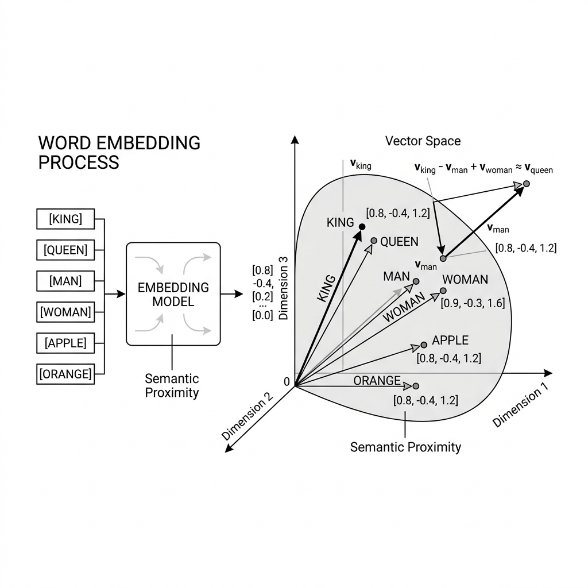
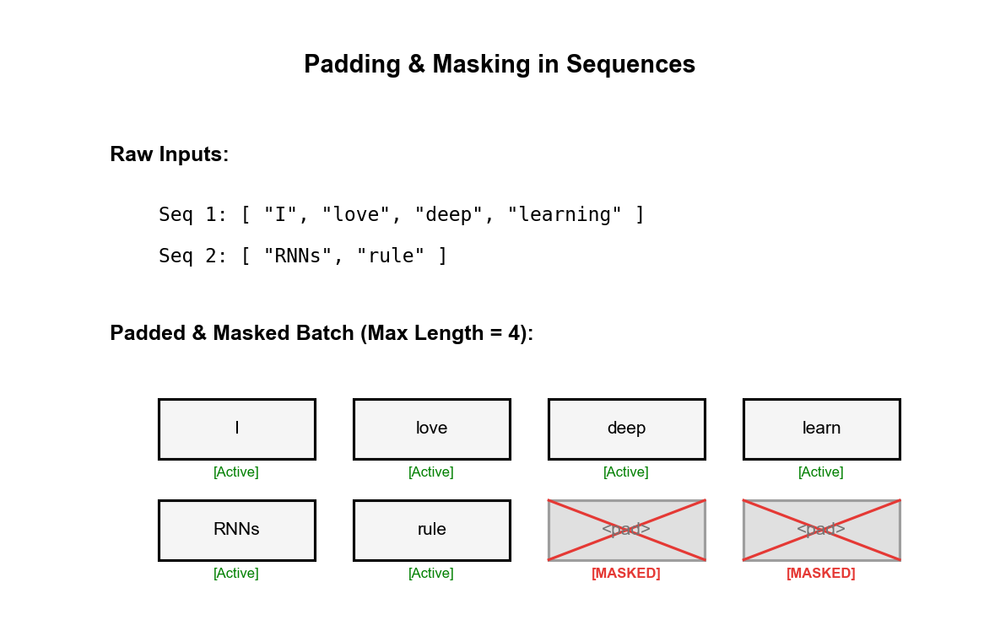

# 🎭 Module 2: Sentiment Analysis and Word Embeddings
> **Ch. 16 — Hands-On ML with Scikit-Learn, Keras & TensorFlow (Aurélien Géron)**

---

## 📌 Table of Contents
1. [Start Here: The Big Picture](#big-picture)
2. [Why One-Hot Encoding Fails](#one-hot)
3. [Word Embeddings: Learning Meaning as Geometry](#embeddings)
4. [Tokenization, Padding & Truncation](#tokenization)
5. [Masking: Ignoring Padding During RNN Processing](#masking)
6. [Reusing Pretrained Embeddings (GloVe / Word2Vec)](#pretrained)
7. [Full End-to-End Sentiment Model](#e2e)
8. [The Transition to Contextual Embeddings](#modern)
9. [Key Terms Dictionary](#terms)
10. [Common Beginner Mistakes](#mistakes)
11. [Interview Q&A (Top 4)](#interview)
12. [⚡ One-Page Flash Card](#revision)

---

## 🌍 Start Here: The Big Picture {#big-picture}

> **TL;DR:** We build a model to classify movie reviews as positive or negative by converting text to vectors, analyzing sequence patterns with an RNN, and outputting a probability.

**Sentiment Analysis:** Given a movie review, predict if it's 👍 (positive) or 👎 (negative).

**The IMDB Dataset (reference benchmark):**
- 50,000 movie reviews
- 25,000 for training, 25,000 for testing
- Labels: 0 = Negative, 1 = Positive

**Example data:**
```
Review: "This film was absolutely brilliant! I loved every minute."  → Label: 1 (Positive)
Review: "Terrible acting. The plot made zero sense."                  → Label: 0 (Negative)
```

**The Full Pipeline:**
```
Raw Text → Tokenize → Pad/Truncate → Embed → RNN → Dense(sigmoid) → 0.0–1.0
"I love it"  → [4, 8, 2]  → [4, 8, 2, 0, 0] → [vectors...] → GRU → 0.95
```

---

## 📉 Why One-Hot Encoding Fails {#one-hot}

> **TL;DR:** One-hot encoding creates massive, sparse vectors where all words are equidistant. It fails to capture any semantic relationships or generalizations between words.

Suppose our vocabulary has **10,000 words**. One-hot encoding creates a **10,000-dimensional sparse binary vector** for each word.

**The word vector for "dog":**
```
[0, 0, 0, ..., 0, 1, 0, ..., 0, 0]  ← 10,000 dimensions, single 1 at index 4,312
```

**Critical problems:**

1. **No semantic relationship**: The distance between "dog" and "cat" is $\sqrt{2}$. The distance between "dog" and "airplane" is ALSO $\sqrt{2}$. All words are equidistant from each other!

2. **Massive memory**: A sentence of 500 words → 500 × 10,000 = 5,000,000 floats.

3. **No generalization**: Learning that "dog is cute" is positive doesn't help the model understand "puppy is adorable" — they have orthogonal representations.

---

## 🌌 Word Embeddings: Learning Meaning as Geometry {#embeddings}

> **TL;DR:** Instead of sparse one-hot arrays, we use dense, trainable vectors. Through training, the network learns to cluster semantically similar words close together in vector space.

Instead of 10,000 sparse dimensions, we map each word to a **dense 100-dimensional vector**. These vectors are learned during training.


> 📊 **Graph 04:** Word Embeddings cluster semantically similar words together. The vector arithmetic `King - Man + Woman ≈ Queen` emerges purely from training on text — the network discovers gender and royalty as geometric directions.

**Concrete Numerical Example (64 dims shown compressed to 2D):**

| Word | Dim 1 (Royal) | Dim 2 (Gender) | Dim 3 (Animal) | ... |
|------|--------------|---------------|----------------|-----|
| King | **+0.95** | **+0.80** | -0.10 | ... |
| Queen | **+0.93** | **-0.82** | -0.11 | ... |
| Man | +0.10 | **+0.79** | -0.05 | ... |
| Woman | +0.11 | **-0.81** | -0.04 | ... |
| Dog | -0.15 | +0.01 | **+0.95** | ... |
| Cat | -0.12 | -0.02 | **+0.91** | ... |

**The Famous Analogy (Cosine Similarity):**
$$\text{vec}(\text{King}) - \text{vec}(\text{Man}) + \text{vec}(\text{Woman})$$
$$= (+0.95, +0.80, ...) - (+0.10, +0.79, ...) + (+0.11, -0.81, ...)$$
$$\approx (+0.96, -0.80, ...) \approx \text{vec}(\text{Queen}) ✅$$

**Implementation in Keras:**

```python
keras.layers.Embedding(
    input_dim=10000,     # Vocabulary size: how many unique words
    output_dim=128,      # Embedding dimensions: each word → 128D vector
    input_length=200,    # Optional: expected sequence length
    mask_zero=True       # Tell downstream layers to ignore 0-padded positions
)
```

**What is this layer internally?**

The `Embedding` layer is just a **learnable weight matrix** of shape `[10000, 128]`.
When the integer ID `4312` (index for "dog") is passed in, it performs a simple **lookup**: return row 4312 of the weight matrix. This is equivalent to a one-hot matrix multiplication, but 10,000× cheaper.

These 1.28 million weights are updated via backpropagation during training.

---

## ✂️ Tokenization, Padding & Truncation {#tokenization}

> **TL;DR:** Neural networks require fixed-length inputs. We enforce this by truncating long reviews and padding short reviews with zeros.

**The Problem:** Reviews have different lengths. Neural networks require uniform-length tensors.

We need to make all of them the same length (say, 200 words):
- Reviews shorter than 200: **pad with zeros** on the right
- Reviews longer than 200: **truncate** to the first 200 words

**Step-by-Step Numerical Example:**

```python
from tensorflow.keras.preprocessing.text import Tokenizer
from tensorflow.keras.preprocessing.sequence import pad_sequences

reviews = [
    "I loved this movie",     # 4 words
    "It was terrible",        # 3 words
    "Just okay not great"     # 4 words
]
labels = [1, 0, 0]

# Step 1: Build vocabulary mapping
tokenizer = Tokenizer(num_words=10000, oov_token="<UNK>")
tokenizer.fit_on_texts(reviews)

# Step 2: Convert texts to integer sequences
sequences = tokenizer.texts_to_sequences(reviews)

# Step 3: Pad to uniform length
X = pad_sequences(sequences, maxlen=6, padding='post', truncating='post')
print(X)
# → [[2, 3, 4, 5, 0, 0],   ← padded with 0s on right
#    [6, 7, 8, 0, 0, 0],   ← padded with 0s on right
#    [9, 10, 11, 12, 0, 0]] ← padded with 0s on right
```

---

## 🎭 Masking: Ignoring Padding During RNN Processing {#masking}

> **TL;DR:** Padding zeros can dilute the RNN's memory. Masking tells the network to ignore padded steps, seamlessly copying the last meaningful state to the end.

**The Critical Problem:**
After padding, our sequences look like:
`[6, 7, 8, 0, 0, 0]   ← "It was terrible" + 3 padding zeros`

If we feed this to an RNN **without masking**, the GRU will process all 6 positions, and by step 6, it will have almost forgotten the word "terrible" due to the 3 steps of empty zero-padding.

**The Solution: `mask_zero=True`**


> 📊 **Graph 05:** With masking, the GRU simply copies `h_{t-1}` to `h_t` at any position where the input is 0 (padding). The hidden state is perfectly preserved through the padding positions.

```python
# mask_zero=True tells the Embedding layer to generate a boolean mask tensor.
embedding_layer = keras.layers.Embedding(
    input_dim=10000, 
    output_dim=128,
    mask_zero=True   # ← This is all you need!
)
```

**What happens under the hood:**
The mask is automatically **propagated** to the GRU layer. When the GRU processes position $t$ with `mask[t] = False`, it does **NOT** run the GRU equations. It simply sets $h_t = h_{t-1}$ (copy previous state).

---

## 📦 Reusing Pretrained Embeddings (GloVe / Word2Vec) {#pretrained}

> **TL;DR:** We can reuse embeddings (like GloVe) that were pre-trained on massive text datasets to give our model a jump-start. Always freeze them initially to prevent catastrophic forgetting.

Instead of learning embeddings from scratch on 25,000 reviews, we can borrow embeddings trained on **billions of words** (Wikipedia, Common Crawl).

**Step-by-step loading GloVe:**

```python
import numpy as np

# 1. Load GloVe dictionary
glove_path = "glove.6B.100d.txt"
embedding_index = {}
# ... parsing code ...

# 2. Build embedding matrix aligned with OUR tokenizer
vocab_size = 10000
embedding_dim = 100
embedding_matrix = np.zeros((vocab_size, embedding_dim))
for word, idx in tokenizer.word_index.items():
    if idx < vocab_size and word in embedding_index:
        embedding_matrix[idx] = embedding_index[word]

# 3. Create Keras Embedding layer with pretrained weights
embedding_layer = keras.layers.Embedding(
    input_dim=vocab_size,
    output_dim=embedding_dim,
    weights=[embedding_matrix],   # ← load pretrained weights
    trainable=False,              # ← FREEZE first (don't destroy pretrained vectors!)
    mask_zero=True
)
```

**The Two-Phase Training Strategy:**
1. **Phase 1:** Train with frozen embeddings. Let the classification head learn the task.
2. **Phase 2:** Unfreeze embeddings (`trainable = True`). Use a **very small learning rate** (e.g., `1e-5`) to gently fine-tune the embeddings to the specific IMDB domain without catastrophic forgetting.

---

## 💻 Full End-to-End Sentiment Model {#e2e}

> **TL;DR:** We combine the Embedding, Masking, and RNN layers into a Sequential model. A final Dense layer outputs a probability between 0 and 1.

```python
import tensorflow as tf
from tensorflow import keras

vocab_size = 10000
embed_dim = 128
max_len = 200

# Build model
model = keras.models.Sequential([
    # 1. Word ID → Dense Vector
    keras.layers.Embedding(
        vocab_size, embed_dim,
        input_length=max_len,
        mask_zero=True          # Enable masking for padding
    ),
    
    # 2. Process sequence (Bidirectional reads L→R and R→L)
    keras.layers.Bidirectional(
        keras.layers.GRU(64, return_sequences=True, dropout=0.3)
    ),
    keras.layers.Bidirectional(
        keras.layers.GRU(64, dropout=0.3)
    ),
    
    # 3. Classifier Head
    keras.layers.Dense(64, activation="relu"),
    keras.layers.Dropout(0.5),
    keras.layers.Dense(1, activation="sigmoid")  # 0=Negative, 1=Positive
])

model.compile(loss="binary_crossentropy", optimizer="adam", metrics=["accuracy"])
# model.fit(...)
```

---

## 🚀 The Transition to Contextual Embeddings {#modern}

While Word2Vec and GloVe were revolutionary, they are considered **static embeddings**.
For the word *bank*, Word2Vec always returns exactly the same vector, whether the sentence is "I went to the bank" (Financial Institution) or "The river bank is beautiful" (River Edge).

Modern NLP has moved entirely to **contextual embeddings** (like ELMo, BERT, and GPT). In a contextual model, the entire sentence is analyzed at once (usually via Transformers), meaning the vector for *bank* is generated dynamically based on the surrounding words. We cover these advanced architectures in **Module 6**.

---

## 📖 Key Terms Dictionary {#terms}

| Term | Simple Definition |
|------|-------------------|
| **Static Embedding** | Word vectors (like GloVe) that are fixed; a word has the same vector regardless of context. |
| **Masking** | A technique used to tell recurrent layers to ignore padding tokens (zeros) so they don't wash out the learned hidden state. |
| **Catastrophic Forgetting** | When a pretrained model's learned weights are destroyed by large gradient updates during early fine-tuning. Prevented by initially freezing layers. |
| **Bidirectional RNN** | Two RNNs processing the text simultaneously — one reading left-to-right, the other right-to-left, concatenating their outputs. |

---

## ❌ Common Beginner Mistakes {#mistakes}

**1. Using `padding='pre'` then losing sentiment signal** ❌
> **Why it's bad:** If you pad at the front, truncation for long sequences also happens at the front, discarding the beginning of the review which often contains important context.
> **Fix:** Use `padding='post'` (pad at the end) and `truncating='post'` (truncate at the end). Combine with masking so the trailing zeros don't dilute the signal.

**2. Checking accuracy but ignoring class imbalance** ❌
> **Why it's bad:** If a dataset has 90% positive reviews, a naive model that always guesses "Positive" will get 90% accuracy but learn absolutely nothing.
> **Fix:** Always use metrics like AUC-ROC or F1-score for imbalanced data, and balance the loss function using the `class_weight` parameter in `model.fit()`.

**3. Forgetting to freeze pretrained embeddings during Phase 1** ❌
> **Why it's bad:** Uninitialized dense layers will send massive, chaotic gradient updates back into the pre-trained embedding layer, immediately destroying the delicate geometric relationships learned from billions of words (Catastrophic Forgetting).

---

## 🎤 Interview Q&A (Top 4) {#interview}

**Q1: What is the semantic difference between One-Hot Encoding and Word Embeddings?**
> **A:** One-hot creates orthogonal vectors — all word pairs have identical cosine distance of 0. No semantic relationship is captured. Word Embeddings create dense vectors in a learned continuous space where semantic proximity = geometric proximity.

**Q2: How does `mask_zero=True` work technically in Keras?**
> **A:** The Embedding layer checks if any input token equals 0. It creates a boolean mask tensor `M` where `M[b, t] = (X[b, t] != 0)`. This mask is propagated forward to the GRU layer. At any time step $t$ where `M[b, t] = False`, the GRU simply performs `h_t = h_{t-1}` (copies previous state unchanged).

**Q3: What is catastrophic forgetting and how do we prevent it in pretrained embeddings?**
> **A:** It occurs when a pretrained model is fine-tuned with a large learning rate, causing new gradients to overwrite the pre-learned representations. Prevention: 1) Phase 1 — freeze embeddings, train only new layers. 2) Phase 2 — unfreeze with an LR 100× smaller than phase 1.

**Q4: What is the main limitation of GloVe or Word2Vec?**
> **A:** They are static. They assign a single vector to every word, failing to handle polysemy (words with multiple meanings, like "bank" or "apple").

---

## ⚡ One-Page Flash Card {#revision}

```
╔════════════════════════════════════════════════════════════════════════╗
║        MODULE 2 CHEAT SHEET: EMBEDDINGS & SENTIMENT ANALYSIS           ║
╠════════════════════════════════════════════════════════════════════════╣
║                                                                          ║
║  WORD EMBEDDINGS:                                                        ║
║  One-Hot: 10,000D sparse, equidistant, no semantics                     ║
║  Embedding: 128D dense, trainable, semantic = geometric proximity       ║
║  Layer: keras.layers.Embedding(vocab=10000, dim=128, mask_zero=True)   ║
║                                                                          ║
║  MASKING:                                                                ║
║  mask = (inputs != 0) — auto-propagated to downstream RNN layers        ║
║  At masked positions: h_t = h_{t-1} (state preserved, not updated!)    ║
║  Without mask: padding zeros DILUTE the hidden state!                  ║
║                                                                          ║
║  PRETRAINED EMBEDDINGS (GloVe/Word2Vec):                                ║
║  weights=[embedding_matrix] — initialize with pretrained weights        ║
║  Phase 1: trainable=False, train layers above                          ║
║  Phase 2: trainable=True, lr=1e-5 (100x smaller), fine-tune            ║
║                                                                          ║
║  BIDIRECTIONAL GRU:                                                     ║
║  One GRU L→R + one GRU R→L → concatenated output (2× hidden size)     ║
║  Sees full context (past AND future) at every position                  ║
╚════════════════════════════════════════════════════════════════════════╝
```

---

---

**🔗 Previous Module →** [01_Char_RNNs_and_Text_Generation.md](01_Char_RNNs_and_Text_Generation.md)  
**🔗 Next Module →** [03_Encoder_Decoder_and_Translation.md](03_Encoder_Decoder_and_Translation.md)
