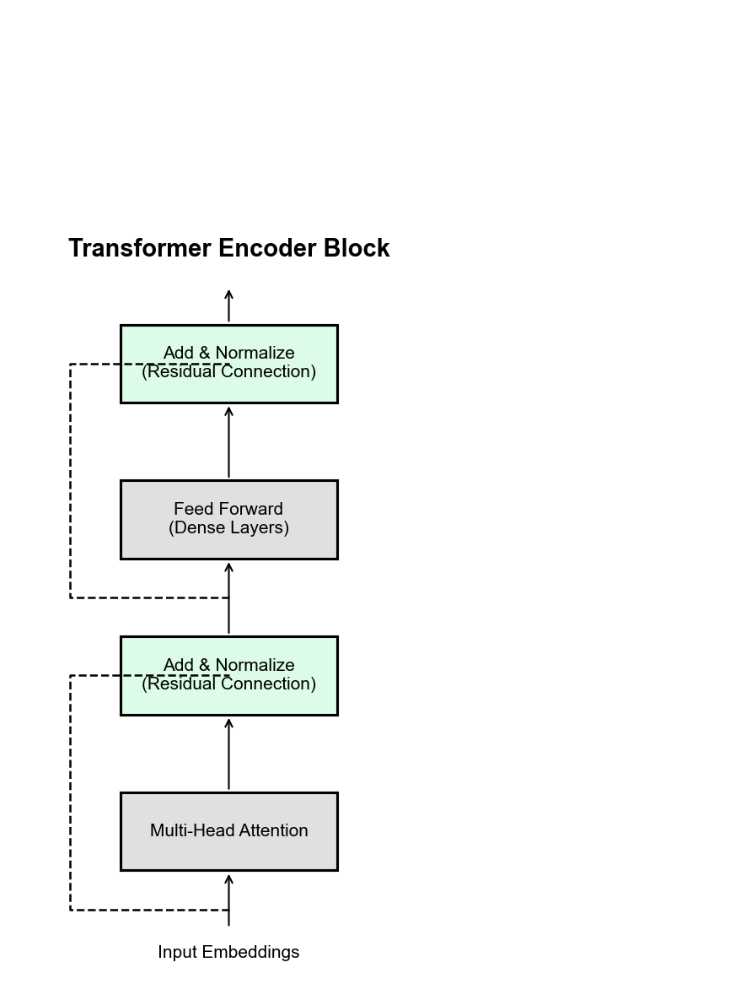

# 🤖 Module 5: The Transformer Architecture — Deep Dive
> **Ch. 16 — Hands-On ML with Scikit-Learn, Keras & TensorFlow (Aurélien Géron)**

---

## 📌 Table of Contents
1. [🌍 Start Here: The Big Picture (2017)](#big-picture)
2. [🔍 The Core Engine: Scaled Dot-Product Attention](#attention)
3. [⚙️ Decoding & Inference Speed (The KV Cache)](#kv-cache)
4. [📍 Positional Encoding (Knowing Where You Are)](#positional)
5. [🔧 Inside the Transformer Block: 2017 vs Today](#transformer-block)
6. [💻 Implementing a Transformer in Keras](#implementation)
7. [❌ Common Beginner Mistakes](#mistakes)
8. [🎤 Interview Q&A (Top 8)](#interview)
9. [⚡ One-Page Flash Card](#revision)

---

## 🌍 Start Here: The Big Picture (2017) {#big-picture}

> **TL;DR:** Transformers replaced RNNs because they allow massive parallelization (training on GPUs) and have direct access to all past words (solving long-range dependencies). 

**Published:** *"Attention Is All You Need"* — Vaswani et al., Google Brain, 2017

### The Two Fatal Flaws of RNNs
1. **Sequential Processing = Cannot Parallelize:** An RNN MUST process word $t$ before word $t+1$. On a 5,000-core GPU, an RNN uses 1 core at a time. The rest sit idle. 
2. **Long-Range Dependencies:** The gradient signal degrades as it passes through the network step-by-step. Word 50 struggles to reference Word 1.

**The Transformer Solution:**
Every word attends to every other word in a SINGLE matrix multiplication. Word 1 is exactly "1 operation away" from word 512. Full GPU parallelism.

---

## 🔍 The Core Engine: Scaled Dot-Product Attention {#attention}

### The Math

Imagine a Python dictionary (hash table), but differentiable:
```
Q_i (Query) = "What am I looking for?"
K_i (Key)   = "What do I contain?"  
V_i (Value) = "What do I deliver?"
```

$$\text{Attention}(\mathbf{Q}, \mathbf{K}, \mathbf{V}) = \text{softmax}\left(\frac{\mathbf{Q}\mathbf{K}^T}{\sqrt{d_k}}\right)\mathbf{V}$$

**WHY SCALE by $\sqrt{d_k}$?**
Without scaling, if $d_k = 1024$, dot products grow massive. 
`softmax([999, 1001, 1005]) ≈ [0.00, 0.02, 0.98]`
This near-one-hot distribution causes **vanishing gradients**. Scaling by $\sqrt{d_k}$ keeps variance stable.

### 🧠 Multi-Head Attention
A single attention head learns ONE type of relationship (e.g., subject-verb agreement).
By projecting $Q,K,V$ into multiple smaller subspaces (heads), the model can simultaneously learn grammar, relative clauses, and semantic roles.

### ⚡ FlashAttention (2022) & FlashAttention-2 (2024)
**The Problem:** Standard attention computes the intermediate matrix $\mathbf{Q}\mathbf{K}^T$. This requires $O(n^2)$ memory.
**The Solution:** FlashAttention computes attention in GPU-friendly blocks (tiling). It **never materializes** the entire matrix in slow GPU memory (HBM), keeping computation in the ultra-fast SRAM.
**Impact:** Exact attention, much less memory, and drastically faster training. 

---

## ⚙️ Decoding & Inference Speed (The KV Cache) {#kv-cache}

> **TL;DR:** During generation, recomputing past tokens is a massive bottleneck. We solve this by caching Keys and Values, and optimize memory using MQA/GQA.

### The KV Cache
During inference, without a cache:
`Token1 → Recompute everything → Token2 → Recompute everything → Token3` (Very slow!)
**With KV Cache:** We store the Keys and Values of all past tokens. We only compute the Query for the *newest* token. Generation becomes dramatically faster.

### The Memory Crisis & Grouped Query Attention (GQA)
If we cache 32 Keys and 32 Values (for 32 heads) over 100k tokens, VRAM usage explodes.
- **Multi-Query Attention (MQA):** 32 Query Heads share **1 Key and 1 Value**. Huge memory savings, but slight quality drop.
- **Grouped Query Attention (GQA):** 32 Query Heads share **8 Key-Value Groups**. The perfect middle ground (Used in Llama 2/3).

---

## 📍 Positional Encoding (Knowing Where You Are) {#positional}

> **TL;DR:** Transformers don't know word order naturally. We must inject position information. Modern models abandoned sine waves for RoPE and ALiBi.

**Original (2017): Sin/Cos Encoding**
Used sine and cosine waves of different frequencies. 
$$PE_{(pos, 2i)} = \sin(pos / 10000^{2i/d_{model}})$$
Problem: Cannot naturally extend well beyond the maximum training length.

**Modern Standard: Rotary Positional Embeddings (RoPE)**
Instead of adding positions to embeddings, RoPE mathematically *rotates* the Query and Key vectors in 2D space based on their position. 
**Advantages:** Captures *relative* positions beautifully and extrapolates better to long contexts. (Used in Llama, Mistral, Qwen).

---

## 🔧 Inside the Transformer Block: 2017 vs Today {#transformer-block}

> **TL;DR:** The architecture of a Transformer block has evolved significantly for better training stability and efficiency.


> 📊 **Graph 12:** The complete Transformer architecture. 

### 1. Normalization: Pre-Norm vs Post-Norm
- **Original (Post-Norm):** Attention → Add → LayerNorm
- **Modern (Pre-Norm):** LayerNorm → Attention → Add
**Why?** Pre-Norm allows for much better gradient flow, preventing instability and allowing the training of models with hundreds of layers.

*(Note: NLP uses **Layer Normalization** instead of Batch Normalization because batch statistics get polluted by varying sequence lengths and padding tokens).*

### 2. Feed-Forward Networks: ReLU → GELU → SwiGLU
- **Original:** Dense → ReLU → Dense
- **Early Modern (BERT/GPT):** Dense → GELU → Dense. (GELU is smoother than ReLU).
- **Current Standard (Llama/PaLM):** **SwiGLU**. 
  $$\text{SwiGLU}(x) = (\text{Swish}(x W_1)) \odot (x W_2)$$
  Provides better parameter efficiency and accuracy.

### 3. The Look-Ahead Mask (Decoder Only)
In the decoder, a token at position $t$ cannot attend to $t+1$. We apply an upper-triangular $-\infty$ mask to the attention scores before the softmax, forcing future weights to $0.0$.

---

## 💻 Implementing a Transformer in Keras {#implementation}

*(Note: Implementing modern SwiGLU/RoPE is complex. Here is the classic Keras implementation of a Transformer Encoder block)*

```python
import tensorflow as tf
from tensorflow import keras

class TransformerEncoderBlock(keras.layers.Layer):
    def __init__(self, d_model, num_heads, dff, dropout_rate=0.1):
        super().__init__()
        # 1. Multi-Head Attention
        self.mha = keras.layers.MultiHeadAttention(num_heads=num_heads, key_dim=d_model//num_heads)
        
        # 2. Feed Forward Network
        self.ffn = keras.Sequential([
            keras.layers.Dense(dff, activation="relu"),  # 512 → 2048
            keras.layers.Dense(d_model)                  # 2048 → 512
        ])
        
        # 3. Layer Normalization (Pre-Norm style is safer in custom loops, but classic is Post-Norm)
        self.norm1 = keras.layers.LayerNormalization(epsilon=1e-6)
        self.norm2 = keras.layers.LayerNormalization(epsilon=1e-6)
        
        self.drop1 = keras.layers.Dropout(dropout_rate)
        self.drop2 = keras.layers.Dropout(dropout_rate)
    
    def call(self, x, training=False, mask=None):
        # Sub-layer 1: Multi-Head Self-Attention + Add & Norm
        attn_output = self.mha(x, x, x, attention_mask=mask) 
        attn_output = self.drop1(attn_output, training=training)
        x = self.norm1(x + attn_output)          # Add & Norm (residual)
        
        # Sub-layer 2: Feed Forward + Add & Norm
        ffn_output = self.ffn(x)
        ffn_output = self.drop2(ffn_output, training=training)
        x = self.norm2(x + ffn_output)            # Add & Norm
        
        return x   # Shape preserved: [batch, seq_len, d_model]
```

---

## ❌ Common Beginner Mistakes {#mistakes}

**1. "High attention weight = The model reasoned about that token"** ❌
> Reality: Attention represents routing and information flow, not human-like reasoning. In deep layers, tokens mix heavily, making direct interpretation via heatmaps misleading.

**2. Not using the Look-Ahead Mask in the Decoder's Self-Attention** ❌
> Reality: During training with teacher forcing, word $t$ can "see" the ground truth at $t+1$ if unmasked. The decoder will cheat and learn nothing.

**3. Using Batch Normalization instead of Layer Normalization** ❌
> Reality: Batch norm is polluted by varying sequence lengths and padding tokens. Layer norm normalizes each position independently.

**4. Forgetting to scale the dot product** ❌
> Reality: Without scaling by $\sqrt{d_k}$, large $d_k$ causes dot products to explode, pushing softmax into regions with near-zero gradients.

---

## 🎤 Interview Q&A (Top 8) {#interview}

**Q1: What are Q, K, V in the Transformer and where do they come from?**
> **A:** Q (Query), K (Key), and V (Value) are three different linear projections of the SAME input embedding. Conceptually: Q represents "what am I looking for?", K represents "what information do I contain?", V represents "what information will I provide?". 

**Q2: Why do modern LLMs use Pre-LayerNorm?**
> **A:** The original Post-LayerNorm placed normalization after the residual connection addition. Pre-LayerNorm applies it before the attention/FFN sublayers. This vastly improves gradient flow, stabilizes optimization, and enables training networks with hundreds of layers.

**Q3: Why did RoPE replace sinusoidal positional encoding?**
> **A:** Sinusoidal encoding struggles to generalize to sequence lengths beyond what it saw in training. RoPE (Rotary Positional Embeddings) mathematically rotates query and key vectors to capture relative distances naturally, which extrapolates much better to longer contexts.

**Q4: What is the purpose of FlashAttention?**
> **A:** It computes exact attention using memory-efficient GPU tiling (staying in SRAM). This prevents materializing the huge $O(n^2)$ attention matrix in HBM, reducing memory usage and significantly speeding up both training and inference.

**Q5: What is the KV cache?**
> **A:** During autoregressive generation, the model caches previously computed Keys and Values. This ensures only the newest token's Query needs to be processed, avoiding the slow recomputation of the entire sequence history at every step.

**Q6: Why is Grouped Query Attention (GQA) better than Multi-Head Attention for inference?**
> **A:** Standard Multi-Head Attention stores unique K and V vectors for every Query head, causing the KV cache to consume massive VRAM. GQA allows multiple query heads to share a smaller group of K/V heads, drastically reducing memory usage while maintaining model quality.

**Q7: In a Transformer Decoder, why are there THREE different attention mechanisms?**
> **A:** (1) **Masked Self-Attention:** Decoder positions attend to past decoder positions. (2) **Cross-Attention:** Decoder queries attend to the Encoder's Keys and Values (for translation/alignment). (3) The **Feed-Forward Network** applies position-wise non-linear transformations.

**Q8: What is the biggest limitation of vanilla Transformers?**
> **A:** Their self-attention mechanism has quadratic $O(n^2)$ time and memory complexity with respect to sequence length. Processing very long contexts (like entire books) is computationally infeasible without modern optimizations like FlashAttention.

---

## ⚡ One-Page Flash Card {#revision}

```
╔═══════════════════════════════════════════════════════════════════════╗
║              MODULE 5 CHEAT SHEET: THE TRANSFORMER EVOLUTION           ║
╠═══════════════════════════════════════════════════════════════════════╣
║                                                                         ║
║  THE CORE ENGINE (Q,K,V):                                               ║
║  Attention(Q,K,V) = softmax(Q*K^T / sqrt(d_k)) * V                     ║
║  Scale by sqrt(d_k) to prevent softmax saturation (vanishing gradients)║
║                                                                         ║
║  2017 ORIGINAL vs MODERN 2024+:                                         ║
║  • Positional: Sin/Cos Waves     → RoPE (Rotary)                        ║
║  • Normalization: Post-LayerNorm → Pre-LayerNorm (Better gradients)     ║
║  • Feed Forward: ReLU            → SwiGLU                               ║
║  • Attention: Standard O(n^2)    → FlashAttention (SRAM tiling)         ║
║  • Cache: Full Multi-Head        → Grouped Query Attention (GQA)        ║
║                                                                         ║
║  DECODER TRICKS:                                                        ║
║  • Look-Ahead Mask: Upper triangular -∞ matrix prevents seeing future   ║
║  • KV Cache: Saves past Keys/Values to avoid O(n^2) recomputation       ║
╚═══════════════════════════════════════════════════════════════════════╝
```

---

---

**🔗 Previous Module →** [04_Attention_Mechanisms.md](04_Attention_Mechanisms.md)  
**🔗 Next Module →** [06_Recent_Innovations_in_Language_Models.md](06_Recent_Innovations_in_Language_Models.md)
