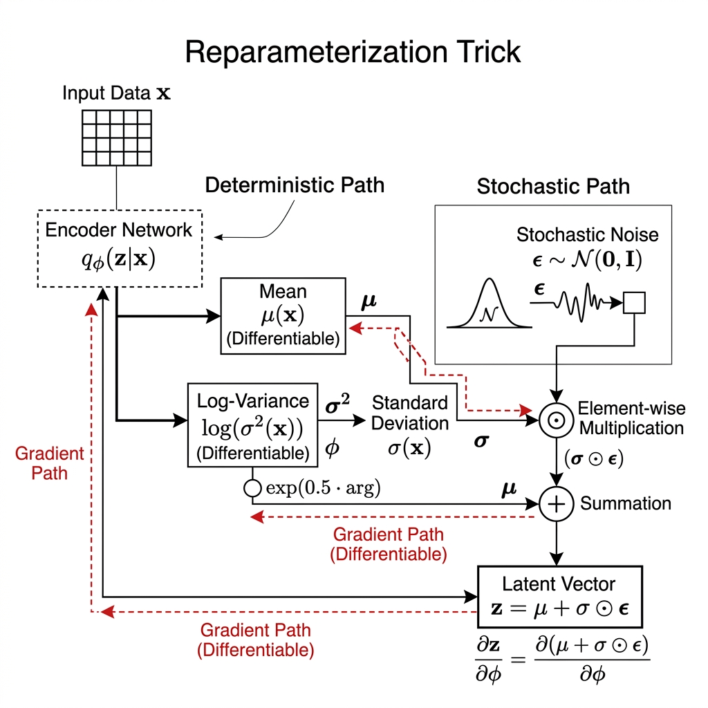
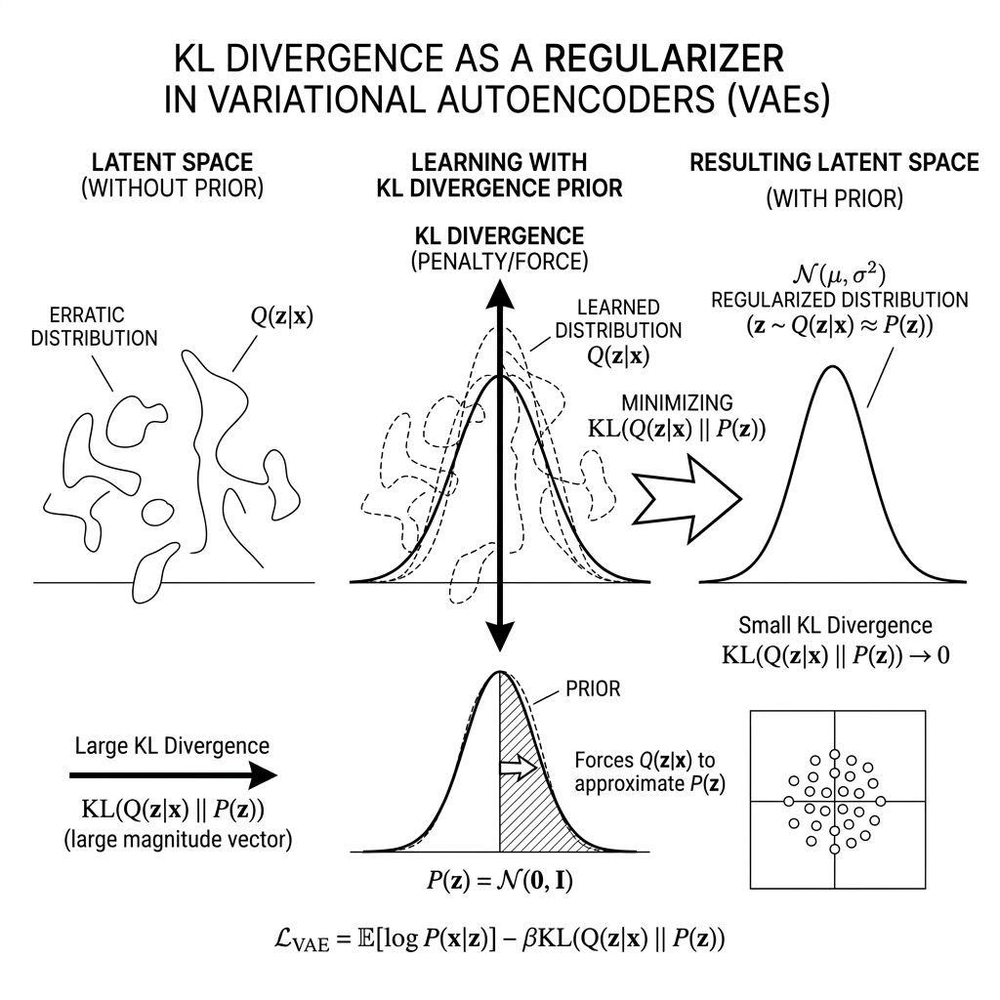
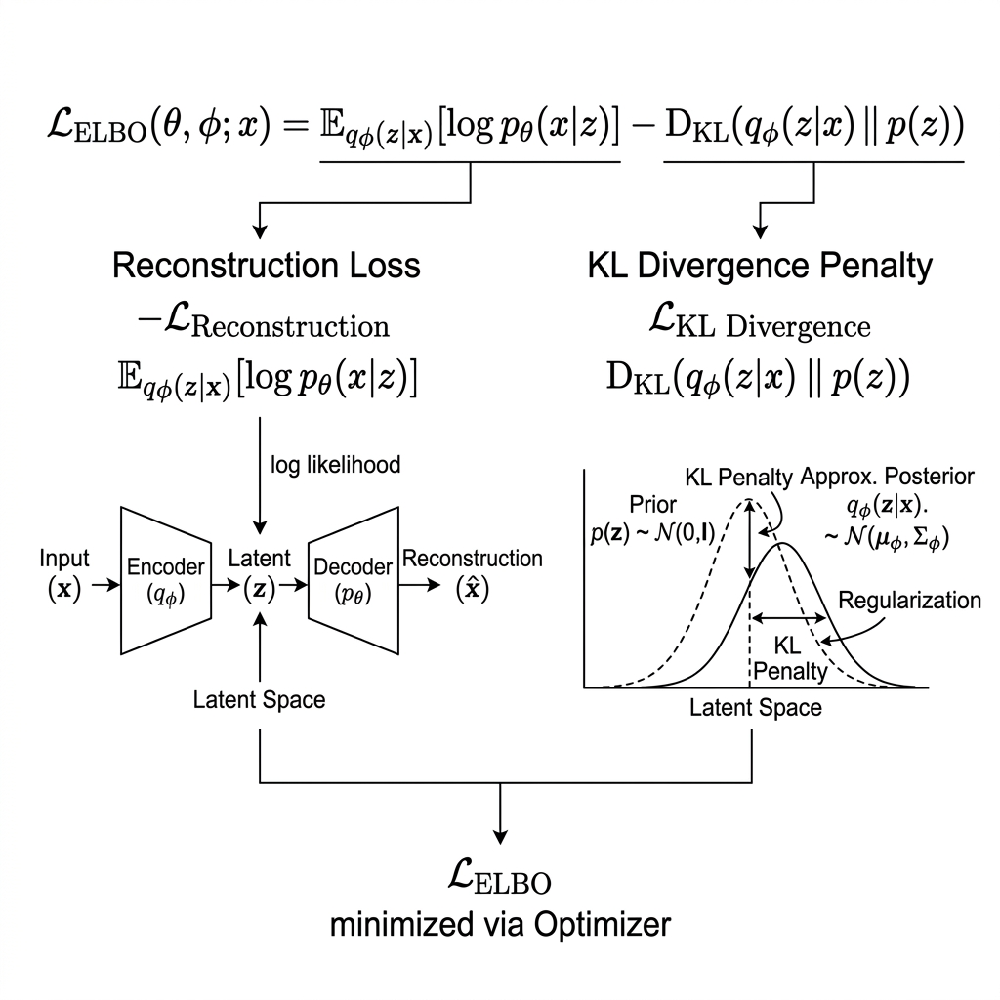
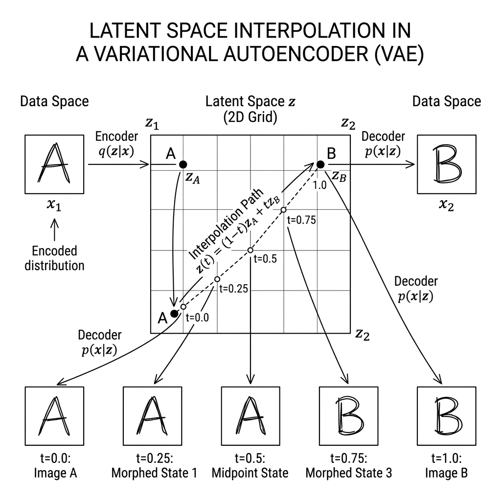
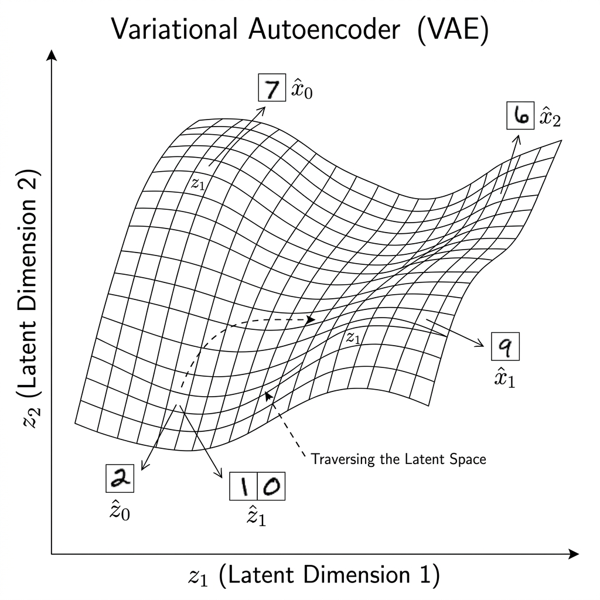

# 🎲 Module 03: Variational Autoencoders (VAEs)
> **Ch. 17 — Hands-On ML with Scikit-Learn, Keras & TensorFlow (Aurélien Géron)**

---

## 📌 Table of Contents
1. [Start Here: The Big Picture](#big-picture)
2. [From Deterministic to Probabilistic Latent Spaces](#probabilistic)
3. [The VAE Architecture](#vae-architecture)
4. [The Reparameterization Trick](#reparameterization)
5. [The ELBO Loss (Reconstruction + KL Divergence)](#elbo)
6. [Full Keras VAE Implementation](#implementation)
7. [Generating New Images from the Latent Space](#generation)
8. [VAE Latent Space Visualization](#visualization)
9. [Common Beginner Mistakes](#mistakes)
10. [Interview Q&A](#interview)
11. [⚡ One-Page Flash Card](#revision)

---

## 🌍 Start Here: The Big Picture {#big-picture}

> **TL;DR:** A Variational Autoencoder (VAE) replaces the deterministic bottleneck of a standard AE with a *probabilistic* one: the encoder outputs a *distribution* (mean `μ` and variance `σ²`) instead of a single point. Sampling from this distribution enables *generative* use — you can sample novel, unseen points from the latent space and decode them into realistic new data.

**The Real-World Analogy 🎨:**
Imagine a standard AE as a **photocopier** — given an input, it produces an exact (compressed) copy. A VAE is more like a **skilled artist who memorizes the "style" of everything they've seen** (distribution), and can then *paint entirely new, plausible artworks* in that style from imagination — not just copy existing ones.

---

## 🔍 1. From Deterministic to Probabilistic Latent Spaces {#probabilistic}

### The Standard AE Problem for Generation
In a standard AE, each input `x` maps to a **single deterministic point** `z` in the latent space. To generate new data, you'd need to sample points from the latent space and decode them — but:
- The latent space is **unstructured**: no two neighboring points map to meaningful outputs.
- Sampling randomly produces **garbage** reconstructions in unexplored regions.
- The latent space has **holes**: regions between encoded data points produce incoherent outputs.

### The VAE Solution: Encode Distributions, Not Points
Instead of mapping `x → z`, the VAE encoder maps:

$$x \rightarrow q_\phi(z | x) = \mathcal{N}(\mu_\phi(x),\; \sigma^2_\phi(x) \cdot I)$$

- `μ_φ(x)`: mean vector (encoded by a Dense layer)
- `σ²_φ(x)`: variance vector (encoded by another Dense layer, as `log σ²` for stability)

The decoder then maps sampled `z ~ q_φ(z|x)` back to reconstructions.

This forces the latent space to be **smooth and continuous**: nearby points in the latent space decode to similar outputs, enabling controlled generation.

---

## 🔍 2. The VAE Architecture {#vae-architecture}

```
                    ┌─────────────────────────────────────────────┐
                    │              ENCODER  (q_φ)                  │
   Input x ──────►  Dense(150,selu) → Dense(100,selu)             │
                    │                        │                     │
                    │              ┌─────────┴──────────┐          │
                    │         Dense(10)            Dense(10)       │
                    │           μ (mean)        log σ² (log var)   │
                    └─────────────────────────────────────────────┘
                                    │               │
                         ┌──────────▼───────────────▼──────────┐
                         │     SAMPLING (Reparameterization)    │
                         │  z = μ + ε · exp(log σ² / 2)        │
                         │  ε ~ N(0, I)                         │
                         └──────────────────┬──────────────────┘
                                            │
                    ┌───────────────────────▼─────────────────────┐
                    │              DECODER  (p_θ)                  │
                    │  Dense(100,selu) → Dense(150,selu)           │
                    │  → Dense(784,sigmoid) → Reshape[28,28]       │
                    └─────────────────────────────────────────────┘
                                            │
                                        Output x̂
```

---

## 🔍 3. The Reparameterization Trick {#reparameterization}

### The Problem: Backprop Through Sampling
The network needs to backpropagate gradients through the sampling step $z \sim \mathcal{N}(\mu, \sigma^2)$. But **sampling is a stochastic operation** — it has no gradient!

### The Solution: Externalize the Randomness
Instead of sampling $z$ directly, rewrite it as:

$$z = \mu + \varepsilon \cdot \sigma, \quad \varepsilon \sim \mathcal{N}(0, I)$$

Now:
- $\epsilon$ is sampled externally (not a parameter → no gradient needed).
- $\mu$ and $\sigma$ are deterministic functions of $x$ → **gradients flow freely** through them.
- The sample $z$ still comes from $\mathcal{N}(\mu, \sigma^2)$ — **mathematically equivalent**.

This is the **reparameterization trick**: a change of variable that makes stochastic nodes differentiable.

```python
class Sampling(keras.layers.Layer):
    """Reparameterization: z = mean + exp(log_var/2) * epsilon"""
    def call(self, inputs):
        mean, log_var = inputs
        # exp(log_var / 2) = std deviation
        epsilon = tf.random.normal(tf.shape(log_var))
        return mean + tf.exp(log_var / 2) * epsilon
```


> 📊 **Graph 09:** The reparameterization trick. Left: Naive sampling `z ~ N(μ, σ²)` is a stochastic operation that blocks backpropagation. Right: Reparameterizing as `z = μ + ε·σ` where `ε ~ N(0,I)` moves the stochasticity to an external input, allowing gradients to flow freely through `μ` and `σ`. `σ² > 0` always, but without constraints a network might predict negative `σ²`. Taking the log removes this constraint: any real number maps to a valid positive variance via `σ² = exp(log σ²)`.

---

## 🔍 4. The ELBO Loss {#elbo}

The VAE optimizes the **Evidence Lower BOund (ELBO)** — a lower bound on the log-likelihood of the data:

$$\mathcal{L}_{VAE} = \underbrace{\mathbb{E}_{z \sim q_\phi}[\log p_\theta(x|z)]}_{\text{Reconstruction Loss}} - \underbrace{D_{KL}(q_\phi(z|x) \| p(z))}_{\text{KL Divergence}}$$

### Term 1: Reconstruction Loss
Measures how well the decoder reconstructs $x$ from sampled $z$.
- **Implementation**: Binary cross-entropy for normalized image pixels.

### Term 2: KL Divergence
Measures how much the learned distribution $q_\phi(z|x) = \mathcal{N}(\mu, \sigma^2)$ deviates from the **prior** $p(z) = \mathcal{N}(0, I)$.

$$D_{KL}(\mathcal{N}(\mu, \sigma^2) \| \mathcal{N}(0, I)) = \frac{1}{2}\sum_j \left(\sigma_j^2 + \mu_j^2 - 1 - \log\sigma_j^2\right)$$

In code (using `log_var = log σ²`):
```python
latent_loss = -0.5 * tf.reduce_sum(
    1 + codings_log_var - tf.exp(codings_log_var) - tf.square(codings_mean),
    axis=-1
)
```

### Why minimize KL divergence?
The KL term pushes the **encoder distribution toward the standard normal prior** $\mathcal{N}(0, I)$:
- Prevents the encoder from simply mapping each input to a very narrow, deterministic spike (degeneration to standard AE).
- Forces different input classes to **overlap slightly** in the latent space → smooth interpolation.
- Ensures the entire latent space is covered → can sample $z \sim \mathcal{N}(0,I)$ and decode meaningful outputs.


> 📊 **Graph 10:** KL divergence penalty visually explained. The loss penalizes the encoder for outputting a posterior distribution `q(z|x)` (orange) that deviates from the standard normal prior `p(z) = N(0,1)` (blue). The penalty shrinks as the distributions align.


> 📊 **Graph 11:** ELBO loss decomposition over training epochs. Reconstruction loss (blue) decreases as the decoder learns the data manifold; KL divergence (orange) increases then stabilizes as the encoder learns to match the prior.

---

## 🔍 5. Full Keras VAE Implementation {#implementation}

```python
import tensorflow as tf
from tensorflow import keras
import numpy as np

# ── Data ──
(X_train, _), (X_test, _) = keras.datasets.mnist.load_data()
X_train = X_train.astype("float32") / 255.0
X_test  = X_test.astype("float32") / 255.0

# ── Sampling Layer ──
class Sampling(keras.layers.Layer):
    def call(self, inputs):
        mean, log_var = inputs
        return tf.random.normal(tf.shape(log_var)) * tf.exp(log_var / 2) + mean

# ── Encoder ──
inputs = keras.Input(shape=[28, 28])
z = keras.layers.Flatten()(inputs)
z = keras.layers.Dense(150, activation="selu")(z)
z = keras.layers.Dense(100, activation="selu")(z)
codings_mean    = keras.layers.Dense(10)(z)       # μ — no activation
codings_log_var = keras.layers.Dense(10)(z)       # log σ² — no activation
codings = Sampling()([codings_mean, codings_log_var])
variational_encoder = keras.Model(
    inputs=[inputs],
    outputs=[codings_mean, codings_log_var, codings]
)

# ── Decoder ──
decoder_inputs = keras.Input(shape=[10])
x = keras.layers.Dense(100, activation="selu")(decoder_inputs)
x = keras.layers.Dense(150, activation="selu")(x)
x = keras.layers.Dense(28 * 28, activation="sigmoid")(x)
outputs = keras.layers.Reshape([28, 28])(x)
variational_decoder = keras.Model(inputs=[decoder_inputs], outputs=[outputs])

# ── VAE Model ──
_, codings_log_var, codings = variational_encoder(inputs)
reconstructions = variational_decoder(codings)
variational_ae = keras.Model(inputs=[inputs], outputs=[reconstructions])

# ── KL Loss (added to model) ──
latent_loss = -0.5 * tf.reduce_sum(
    1 + codings_log_var - tf.exp(codings_log_var) - tf.square(codings_mean),
    axis=-1
)
variational_ae.add_loss(tf.reduce_mean(latent_loss) / (28 * 28))  # Normalize by input dims

variational_ae.compile(loss="binary_crossentropy", optimizer="rmsprop")

history = variational_ae.fit(
    X_train, X_train,
    epochs=25,
    batch_size=128,
    validation_data=(X_test, X_test)
)
# OUTPUT: Epoch 25/25 - loss: 0.3156 - val_loss: 0.3202
```

> [!TIP]
> Dividing `latent_loss` by `(28 * 28)` scales the KL term to the same order of magnitude as the per-pixel binary cross-entropy loss. Without this normalization, the KL term dominates and the VAE learns to ignore the reconstruction quality (a form of **posterior collapse**).

---

## 🔍 6. Generating New Images {#generation}

```python
import matplotlib.pyplot as plt

def generate_images(n_images=10, latent_dim=10):
    """Sample from N(0,I) prior and decode."""
    codings = tf.random.normal(shape=[n_images, latent_dim])
    images = variational_decoder(codings).numpy()

    fig, axes = plt.subplots(1, n_images, figsize=(n_images * 1.5, 2))
    for idx, img in enumerate(images):
        axes[idx].imshow(img, cmap="binary")
        axes[idx].axis("off")
    plt.suptitle("VAE-Generated MNIST Digits", fontsize=12)
    plt.tight_layout()
    plt.show()

generate_images()
# OUTPUT: 10 realistic-looking handwritten digits (never seen in training)
```

### Latent Space Interpolation
```python
def interpolate_digits(img_a, img_b, n_steps=10):
    """Interpolate between two images in latent space."""
    _, _, z_a = variational_encoder(img_a[np.newaxis])
    _, _, z_b = variational_encoder(img_b[np.newaxis])

    alphas = np.linspace(0, 1, n_steps)
    interpolated_z = [alpha * z_b + (1 - alpha) * z_a for alpha in alphas]
    interpolated_z = tf.concat(interpolated_z, axis=0)
    images = variational_decoder(interpolated_z).numpy()

    fig, axes = plt.subplots(1, n_steps, figsize=(n_steps * 1.5, 2))
    for idx, img in enumerate(images):
        axes[idx].imshow(img, cmap="binary")
        axes[idx].axis("off")
    plt.tight_layout()
    plt.show()

# Interpolate between a "4" and a "9"
interpolate_digits(X_test[2], X_test[5])
# OUTPUT: Smooth morphing from one digit to another through latent space
```


> 📊 **Graph 13:** Latent space interpolation. By linearly interpolating between the latent codes of two images (`z_a` and `z_b`) and decoding each step, the VAE produces a smooth, semantically meaningful morph between a digit '1' and '0'.

---

## 🔍 7. VAE Latent Space Visualization {#visualization}

```python
from sklearn.manifold import TSNE

# Encode test set
z_mean, _, _ = variational_encoder(X_test[:2000])
z_mean = z_mean.numpy()

# t-SNE for 2D visualization
tsne = TSNE(n_components=2, random_state=42)
z_2d = tsne.fit_transform(z_mean)

plt.figure(figsize=(10, 8))
scatter = plt.scatter(z_2d[:, 0], z_2d[:, 1], c=y_test[:2000], cmap="tab10", alpha=0.7)
plt.colorbar(scatter, label="Digit Class")
plt.title("VAE Latent Space (t-SNE) — MNIST")
plt.show()
# OUTPUT: 10 well-separated clusters (one per digit), with smooth boundaries between them
```


> 📊 **Graph 12:** VAE latent space means plotted by digit class. The KL regularization forces all classes to cluster near the origin, ensuring smooth, overlapping regions for continuous generation.

---

## ❌ Common Beginner Mistakes {#mistakes}

**1. "Adding an activation to the μ and log σ² output layers"** ❌
> `codings_mean` and `codings_log_var` must have **no activation** (linear output). Adding sigmoid constrains `μ ∈ (0,1)` and prevents the encoder from placing clusters far from the origin, breaking the latent space structure.

**2. "Forgetting to normalize the KL loss"** ❌
> The KL loss is summed over latent dimensions and over the batch. If not divided by image size `(28×28)`, the KL term dominates the reconstruction loss → **posterior collapse**: the encoder ignores the input and always outputs `N(0,I)`, making the decoder a pure prior sampler (very poor quality).

**3. "Using MSE for image reconstruction loss"** ❌
> MSE treats each pixel independently and produces blurry reconstructions. For images in [0,1], **binary cross-entropy** is theoretically preferred as it corresponds to a Bernoulli likelihood model. In practice, VAE outputs are notoriously slightly blurry regardless.

**4. "Confusing the reparameterization trick purpose"** ❌
> The reparameterization trick is NOT about making sampling deterministic — the output `z` is still stochastic. It's about making the *parameters* (`μ`, `σ`) **differentiable** so gradients can flow back through the sampling step.

---

## 🎤 Interview Q&A {#interview}

**Q1: What is the reparameterization trick and why is it essential for training VAEs?**
> **A:** The reparameterization trick is a mathematical change-of-variable that makes the sampling step differentiable. Without it: `z ~ N(μ, σ²)` is a stochastic node — gradients cannot flow through a random sampling operation. The trick rewrites `z = μ + ε·σ` where `ε ~ N(0,I)` is an *external* random variable. Now:
> - `ε` is not a model parameter → no gradient needed.
> - `μ` and `σ` are deterministic functions of `x` → gradients flow through them to the encoder via standard backpropagation.
> - The distribution of `z` is unchanged: `z ~ N(μ, σ²)` as required.
>
> This is what enables end-to-end training of the VAE using standard gradient descent.

**Q2: What is posterior collapse in VAEs, and how do you prevent it?**
> **A:** **Posterior collapse** occurs when the KL divergence term in the ELBO dominates the reconstruction loss, causing the encoder to learn `q_φ(z|x) = p(z) = N(0,I)` — i.e., the latent code `z` becomes completely independent of the input `x`. The decoder then operates as a pure prior sampler with no input-specific information. Prevention strategies:
> 1. **KL annealing**: Start with KL weight = 0 and gradually increase it during training (β-VAE schedule).
> 2. **β-VAE**: Explicitly tune the weight `β` in `L = Reconstruction + β·KL`. `β < 1` reduces posterior collapse.
> 3. **Normalize KL loss**: Divide by input dimensions so it's on the same scale as per-element reconstruction loss.
> 4. **Increase latent dimension**: More latent dimensions = more capacity for input-specific information.

**Q3: How does the VAE latent space differ from a standard AE latent space for generative purposes?**
> **A:** Key differences:
> - **Standard AE**: Each input maps to a *point* in latent space. Points cluster by class but there is no guarantee of continuity — gaps between clusters produce garbage outputs when sampled. Cannot be used for generation without interpolation hacks.
> - **VAE**: Each input maps to a *region* (Gaussian) in latent space. The KL term pushes all these regions toward `N(0,I)`, ensuring the entire latent space is covered. Sampling `z ~ N(0,I)` at inference *always* produces a point inside some learned cluster → realistic outputs. The smooth coverage also enables linear interpolation between concepts in latent space.

---

## ⚡ One-Page Flash Card {#revision}

```
╔══════════════════════════════════════════════════════════════════╗
║              MODULE 03 — VARIATIONAL AUTOENCODERS                ║
╠══════════════════════════════════════════════════════════════════╣
║                                                                  ║
║  ENCODING:                                                       ║
║  x → Encoder → μ, log σ²   (two separate Dense layers)          ║
║  z = μ + ε·exp(log σ²/2),   ε ~ N(0,I)  [Reparameterization]   ║
║                                                                  ║
║  LOSS:                                                           ║
║  L = BCE(x, x̂) + KL(N(μ,σ²) || N(0,I))                        ║
║  KL = -0.5 * Σ(1 + log σ² - σ² - μ²)                           ║
║  → Normalize KL by image size to prevent posterior collapse      ║
║                                                                  ║
║  GENERATION (inference):                                         ║
║  z ~ N(0, I)  →  Decoder(z)  →  New image                       ║
║                                                                  ║
║  KEY SETTINGS:                                                   ║
║  - μ, log σ² layers: NO activation (linear output)              ║
║  - Latent dim: 10 (MNIST), 128-512 (faces/complex images)        ║
║  - Loss: binary_crossentropy (not MSE)                           ║
║                                                                  ║
║  COMMON PITFALLS:                                                ║
║  - No activation on μ, log σ²                                    ║
║  - Normalize KL loss / (28*28) → avoid posterior collapse        ║
║  - β-VAE: tune β to balance reconstruction vs disentanglement    ║
╚══════════════════════════════════════════════════════════════════╝
```

---

---

**🔗 Previous Module →** [02_Sparse_and_Denoising_Autoencoders.md](02_Sparse_and_Denoising_Autoencoders.md)  
**🔗 Next Module →** [04_Generative_Adversarial_Networks.md](04_Generative_Adversarial_Networks.md)
