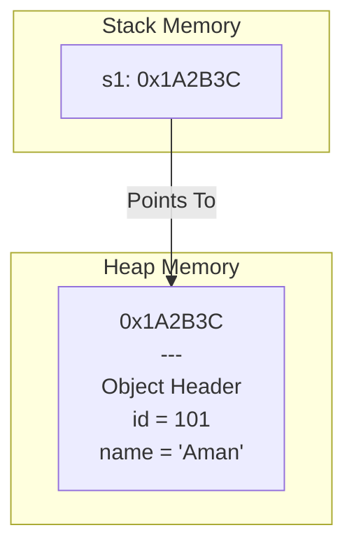

# Classes and Objects

## Definition

A **Class** is a user-defined blueprint, template, or prototype from which objects are created. It defines a logical structure consisting of attributes (state) and methods (behavior). 

An **Object** is a physical, real-world entity that is an instance of a class. When a class is instantiated, memory is allocated, and the object comes into existence with its own independent state.

**Deep Dive:** In memory terms, a class is purely a compile-time concept (it resides in the `.text` segment as instructions, with no data memory allocated). An object is a runtime concept, representing a contiguous block of memory allocated (usually on the heap) to hold the instance variables defined by the class blueprint.

## Why It Is Needed

Procedural programming passes raw data structures to decoupled functions. Classes bind the data and the functions that mutate that data together. This achieves **Cohesion** (things that change together are grouped together) and allows for the creation of multiple independent stateful entities without polluting global namespace.

## Key Concepts

- **Instance Variables (State):** Memory allocated specifically for each object.
- **Member Functions (Behavior):** Code shared across all objects of the class.
- **Reference Variable:** A pointer (hidden in Java, explicit in C++) that holds the memory address of the object on the heap.
- **`new` Keyword:** The operator that asks the OS for memory on the heap and invokes the constructor.

## How It Works Internally

When you execute `Student s1 = new Student();`:
1. **Class Loading (Java):** The JVM checks if `Student.class` is loaded in the Method Area. If not, it loads it.
2. **Memory Allocation:** The JVM/OS allocates a block of memory on the **Heap** large enough to hold all instance variables of `Student`, plus object headers (metadata like locks and garbage collection flags).
3. **Initialization:** The memory is zeroed out (default values), and then the **Constructor** executes to set specific values.
4. **Reference Assignment:** A local variable `s1` is created on the **Stack**, which holds the hexadecimal memory address pointing to the newly created object on the Heap.



## Syntax & Code Example

Let's look at a C++ example to clearly see the difference between Stack and Heap allocation, which is a common interview topic.

### C++ Stack vs Heap Instantiation

```cpp
#include <iostream>
using namespace std;

class Student {
public:
    int id;
    string name;

    Student(int i, string n) : id(i), name(n) {} // Constructor
    
    void display() {
        cout << "ID: " << id << ", Name: " << name << endl;
    }
};

int main() {
    // 1. Stack Allocation (Automatic Storage Duration)
    // Memory is allocated on the stack. Very fast.
    Student s1(101, "Aman"); 
    s1.display(); 
    // s1 is automatically destroyed when main() ends.

    // 2. Heap Allocation (Dynamic Storage Duration)
    // Memory is requested from the OS via 'new'. Slower allocation.
    Student* s2 = new Student(102, "Riya");
    s2->display(); // Notice the arrow operator (->) for pointers
    
    // WARNING: Heap objects must be manually destroyed in C++
    delete s2; 
    
    return 0;
}
```

### Line-by-Line Breakdown:
- `Student s1(...)`: This allocates contiguous bytes directly on the call stack. It is incredibly fast and cache-friendly. The object is destroyed automatically when the function returns (RAII principle).
- `Student* s2 = new Student(...)`: This asks the OS memory manager for heap space. `s2` itself is just an 8-byte pointer on the stack, containing the address of the actual object data on the heap. If you forget `delete s2;`, you create a **Memory Leak**.

## Edge Cases

### Edge Case 1: Object Slicing (C++ Specific)
- **What happens:** If you pass a derived class object by *value* to a function expecting a base class object, the C++ compiler will "slice off" all the derived-class specific attributes to make it fit into the base-class memory footprint.
- **Expected Behavior:** Polymorphism is broken. The object is truncated.
- **Best Practice:** Always pass objects by reference (`Base&`) or pointer (`Base*`) in C++ to preserve polymorphism and avoid slicing.

### Edge Case 2: Memory Alignment and Padding
- **What happens:** The size of an object in memory is rarely just the sum of its variables.
  ```cpp
  class A {
      char c;   // 1 byte
      int i;    // 4 bytes
  };
  ```
  You might think `sizeof(A)` is 5 bytes. It's usually 8 bytes.
- **Why:** CPUs read memory in chunks (words). The compiler inserts "padding" (empty bytes) after the `char` to align the `int` to a 4-byte boundary, optimizing CPU fetch speeds. This is critical knowledge for Systems/Embedded engineering interviews.

## Tricky FAANG Interview Questions

### Question 1: Pass-by-Value vs Pass-by-Reference in Java
**Q:** *Does Java pass objects by reference? If I pass `Student s` to a method and do `s = new Student()`, will the original object reference in `main` change?*
**Answer & Explanation:** **No. Java is strictly Pass-by-Value.** However, when you pass an object, you are passing the *value of the reference* (the memory address). 
If the method does `s.name = "Bob"`, it follows the address and mutates the original object. BUT, if the method does `s = new Student()`, it is merely overwriting the local stack copy of the pointer to point to a new heap location. The original pointer in `main` remains completely unaffected.
**Why it's asked:** This is the #1 most confused concept among mid-level Java developers. Interviewers use it to see if you truly understand stack frames and pointer manipulation.

### Question 2: Dangling Pointers (C++)
**Q:** *What is a dangling pointer, and how do you prevent it?*
**Answer & Explanation:** A dangling pointer occurs when an object is deleted/deallocated from the heap, but the pointer variable still holds the memory address. Dereferencing it causes undefined behavior (often a segfault). 
**Prevention:**
1. Set the pointer to `nullptr` immediately after `delete`.
2. Better: Use C++11 Smart Pointers (`std::unique_ptr`, `std::shared_ptr`) which automatically manage memory and nullification using RAII.

### Question 3: Static vs Instance Context
**Q:** *Why can't you use the `this` keyword inside a `public static void main` method?*
**Answer & Explanation:** The `this` keyword is a hidden pointer passed to *instance methods* representing the specific object calling the method. A `static` method belongs to the class blueprint itself and can be called without any object existing. Therefore, there is no specific instance to point to, making `this` meaningless and invalid in a static context.

## OA Tips

- If you need to map complex data (e.g., a coordinate with a cost `(x, y, cost)`), **do not** use arrays `int[] {x, y, cost}`. Create a `class Cell { int x, y, cost; }`. It makes the code instantly readable to the grader and drastically simplifies custom sorting via `Comparator`.

## 2-Minute Revision

- **Class:** Logical blueprint. Resides in Code Segment. No data memory allocated.
- **Object:** Physical runtime instance. Resides in Heap Memory.
- **Stack Allocation (C++):** Fast, automatic cleanup (RAII).
- **Heap Allocation (Java/C++ `new`):** Dynamic, requires Garbage Collection (Java) or manual `delete` (C++).
- **Padding:** Compilers add empty bytes to objects to align memory for faster CPU access.
- **Java Passing:** Passes the *value* of the reference. Mutating fields alters the original; reassigning the reference does not.


---
## 🚀 50 LPA Senior Engineer Deep Dive: Memory Alignment & Padding

When you create a class, the OS and compiler do not just pack variables together. They align them in memory to match the CPU's word boundaries (usually 4 or 8 bytes) to minimize CPU fetch cycles.

### The Padding Problem
Look at this C++ class:
```cpp
class Order {
    bool isBuy;      // 1 byte
    double price;    // 8 bytes
    int quantity;    // 4 bytes
};
```
You would expect `sizeof(Order)` to be `1 + 8 + 4 = 13 bytes`. 
Instead, the compiler outputs **24 bytes**.

**Why?** The CPU fetches memory in 8-byte chunks on a 64-bit system. 
1. `isBuy` takes 1 byte. The compiler adds **7 bytes of invisible padding** so the next variable (`price`) starts exactly at an 8-byte boundary. 
2. `price` takes 8 bytes.
3. `quantity` takes 4 bytes. The compiler adds **4 bytes of padding** at the end so the total object size is a multiple of 8 (24 bytes).

### The 50 LPA Solution
By simply reordering the variables from largest to smallest, you eliminate padding:
```cpp
#include <iostream>

class OptimizedOrder {
    double price;    // 8 bytes
    int quantity;    // 4 bytes
    bool isBuy;      // 1 byte
                     // 3 bytes of padding at the end
};

int main() {
    std::cout << "Bad Order Size: " << sizeof(Order) << " bytes\n";
    std::cout << "Optimized Size: " << sizeof(OptimizedOrder) << " bytes\n";
    // Output:
    // Bad Order Size: 24 bytes
    // Optimized Size: 16 bytes
    return 0;
}
```
Now `sizeof(OptimizedOrder)` is **16 bytes**. 
If your application stores 100 Million orders in an in-memory cache, **you just saved 800 Megabytes of RAM** simply by reordering class variables!

### 50 LPA FAANG Questions
**Q:** *Explain how class field ordering affects Garbage Collection in Java.*
**A:** While Java developers cannot control exact memory layouts like C++ developers (the JVM optimizes field packing automatically), understanding object headers (Mark Word and Klass Pointer, taking 12-16 bytes) is critical. Creating millions of tiny objects (like `new Integer(5)`) causes immense GC pressure and memory bloat compared to using primitive arrays, because the object headers take up more RAM than the data itself.
