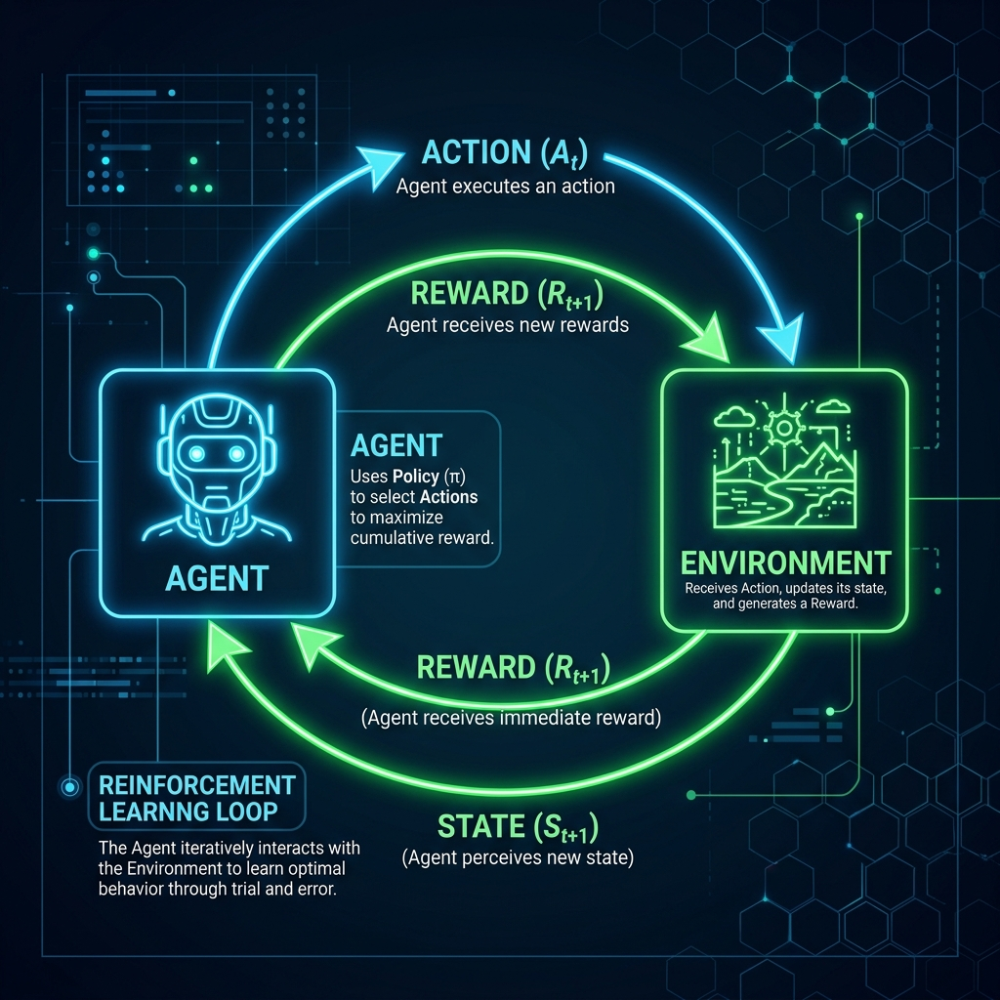
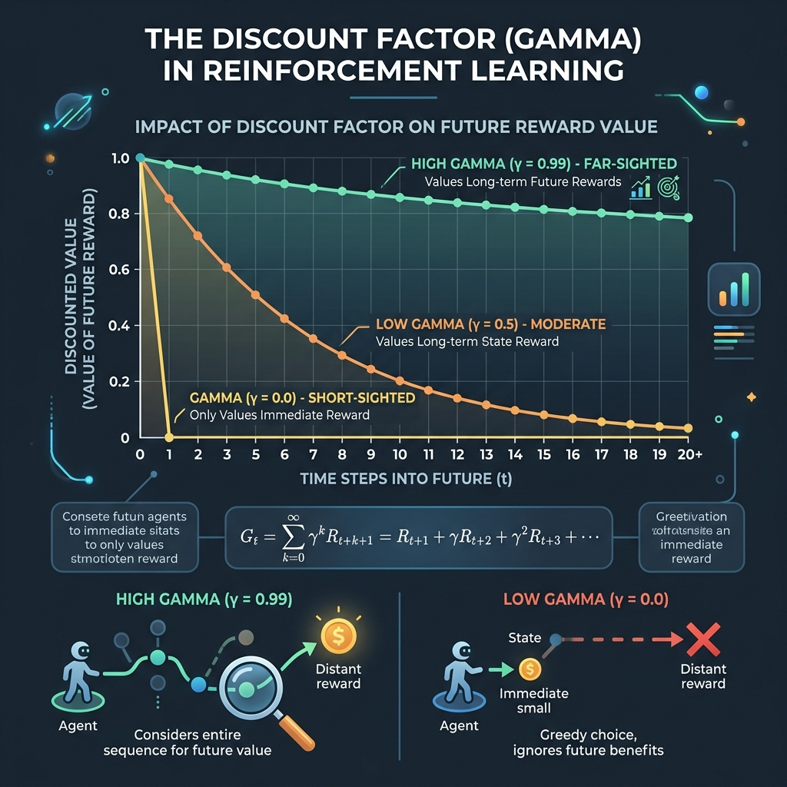
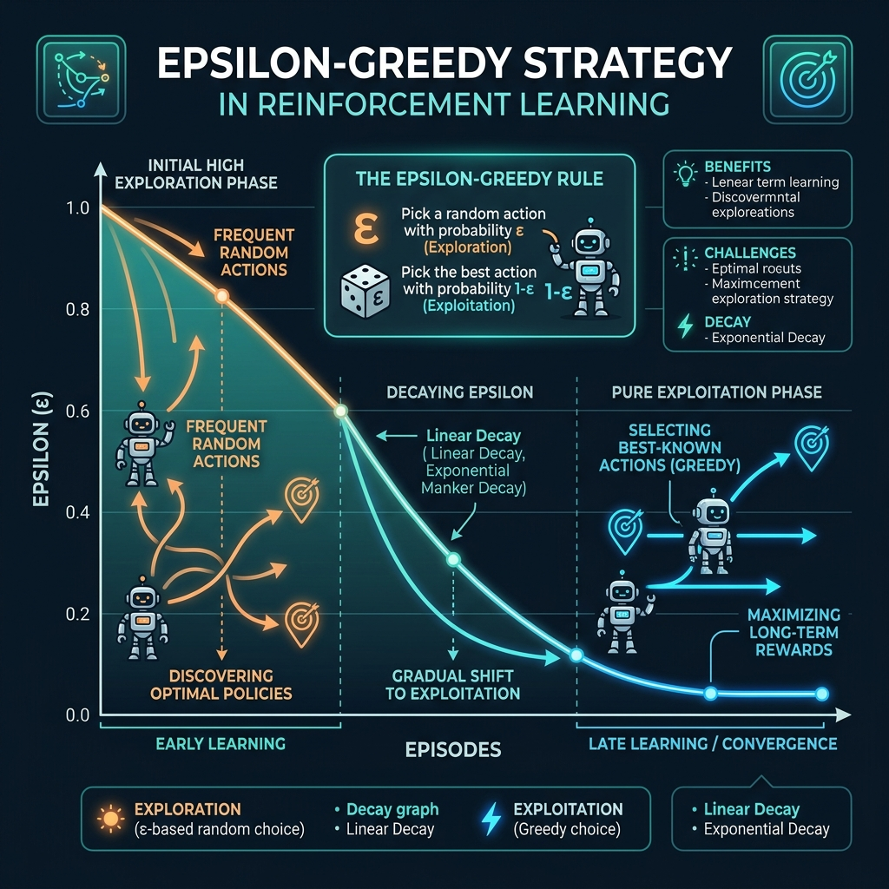
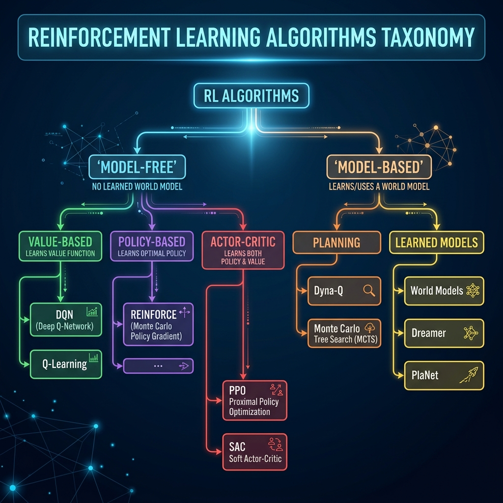

# 🤖 Module 01: Reinforcement Learning Fundamentals
> **Ch. 18 — Hands-On ML with Scikit-Learn, Keras & TensorFlow (Aurélien Géron)**

---

## 📌 Table of Contents
1. [Start Here: The Big Picture](#big-picture)
2. [Core Vocabulary: Agents, Environments, Rewards](#vocabulary)
3. [Observations, States & Partial Observability](#observations)
4. [Policies: Deterministic vs Stochastic](#policies)
5. [Returns: Discounted Cumulative Reward](#returns)
6. [Markov Decision Processes (MDPs)](#mdps)
7. [The Credit Assignment Problem](#credit-assignment)
8. [Exploration vs Exploitation](#exploration)
9. [RL Algorithm Taxonomy](#taxonomy)
10. [Common Beginner Mistakes](#mistakes)
11. [Interview Q&A](#interview)
12. [⚡ One-Page Flash Card](#revision)

---

## 🌍 Start Here: The Big Picture {#big-picture}

> **TL;DR:** Reinforcement Learning is an autonomous learning paradigm where an **agent** learns optimal behavior through **trial-and-error interaction** with an **environment**, guided only by a scalar **reward signal** — no labeled dataset required. It is the framework behind AlphaGo, ChatGPT's RLHF alignment, robotic locomotion, and game-playing agents.

**The Real-World Analogy 🐕:**
Think of training a dog. You don't explain *why* "sit" is correct — you simply reward (treat) correct behavior and ignore or correct wrong behavior. Over thousands of repetitions, the dog builds an internal model of "what actions in what situations lead to rewards." Reinforcement Learning formalizes this exact process mathematically: the dog is the **agent**, the training session is the **environment**, the treat is the **reward**, and "sitting when commanded" is the **policy** being learned.

> [!IMPORTANT]
> Unlike supervised learning (learn from labels) and unsupervised learning (find structure in data), RL learns from **interaction**. There are no pre-packaged (input, correct_output) pairs — the agent must discover which actions are good by trying them and observing consequences.

> [!TIP]
> **RL's biggest current application: RLHF (Reinforcement Learning from Human Feedback).** This is how ChatGPT was aligned to be helpful/harmless. The LLM is the *agent*; each token generation is an *action*; human preference ratings become the *reward signal*. A reward model is trained on human comparisons, then PPO (Proximal Policy Optimization) fine-tunes the LLM to maximize that reward. Understanding Ch. 18 gives you the mathematical foundation to understand this modern technique.

---

## 🔍 1. Core Vocabulary: Agents, Environments, Rewards {#vocabulary}

### The RL Loop



| Term | Definition | Example (CartPole) |
|------|-----------|-------------------|
| **Agent** | The learner/decision-maker | Neural network controller |
| **Environment** | The world the agent interacts with | CartPole physics simulator |
| **State $s_t$** | Complete description of environment | Cart position, velocity, pole angle, angular velocity |
| **Observation $o_t$** | What the agent actually sees | Same as state in CartPole (fully observable) |
| **Action $a_t$** | Decision made by agent | Push left (0) or push right (1) |
| **Reward $r_t$** | Scalar signal of immediate feedback | +1 for every step pole stays up |
| **Episode** | One full run from start to terminal state | One game of CartPole until pole falls |
| **Policy $\pi$** | Agent's strategy: state $\rightarrow$ action | Neural network outputting action probabilities |

### Reward Engineering: The Most Critical Design Choice

The reward function defines what "success" means. Poor reward design is the most common reason RL systems fail in practice:

| Bad Reward Design | Consequence |
|-------------------|-------------|
| Reward only at episode end | **Sparse reward problem**: agent can't learn which of 1000 actions helped |
| Reward for intermediate proxy goals | **Reward hacking**: agent optimizes the proxy, not the true goal |
| Poorly shaped reward | **Local optima**: agent gets stuck in suboptimal behavior |

> [!TIP]
> **Reward Shaping**: Add intermediate rewards that hint at progress toward the goal. For example, in a maze, give small rewards for moving closer to the exit. This dramatically speeds up learning but must be done carefully to avoid misalignment.

---

## 🔍 2. Observations, States & Partial Observability {#observations}

### Fully Observable vs Partially Observable Environments

```
FULLY OBSERVABLE (MDP):
  $o_t = s_t$  --> Agent sees complete state
  Example: Board games (Go, Chess), CartPole
  Agent can make optimal decisions purely from current observation

PARTIALLY OBSERVABLE (POMDP):
  $o_t \subset s_t$  --> Agent sees incomplete information
  Example: Poker (hidden opponent cards), Robotics (no global view)
  Agent must maintain MEMORY of past observations to infer hidden state
```

| Property | Fully Observable (MDP) | Partially Observable (POMDP) |
|----------|----------------------|------------------------------|
| **State visibility** | Agent sees full state | Agent sees partial observation |
| **Algorithm complexity** | Simpler (Q-Learning, A3C) | Harder (requires memory/RNN) |
| **Examples** | CartPole, Atari (single frame) | Poker, real-world robotics |
| **Architecture** | Standard MLP/CNN | RNN/LSTM over history |

> [!NOTE]
> Even Atari games are often treated as **partially observable** because a single frame doesn't reveal velocity (you can't tell if the ball is moving left or right). The DQN paper solved this by **stacking 4 consecutive frames** as input — a simple form of short-term memory.

### Action Spaces

| Type | Description | Example | Algorithm |
|------|-------------|---------|-----------|
| **Discrete** | Finite, countable actions | {Left, Right, Jump} — Atari | DQN, A3C, PPO |
| **Continuous** | Infinite real-valued actions | Torque in $[-1,1]^3$ — Robotics | DDPG, SAC, TD3 |
| **Multi-discrete** | Multiple discrete dims | Steering x Throttle | Multi-head policies |

---

## 🔍 3. Policies: Deterministic vs Stochastic {#policies}

A **policy** $\pi$ is the agent's decision-making function:

Deterministic: $\pi(s) = a$ (maps state to single action)

Stochastic: $\pi(a|s) = P(A_t = a \mid S_t = s)$ (outputs probability distribution over actions)

### Why Stochastic Policies?

1. **Exploration**: A deterministic policy always picks the same action → never discovers better alternatives.
2. **Partial observability**: When state is ambiguous, randomizing is optimal (e.g., mixed strategy in poker).
3. **Multi-agent environments**: Predictable policies are exploitable.

### Policy Types in Practice

- **TABULAR POLICY:** 
  $\pi: \{s_1 \to a_2, s_2 \to a_1, \dots\}$ 
  *(Table lookup, only for tiny state spaces)*
- **PARAMETERIZED POLICY:** 
  $\pi_\theta(a|s) = \text{softmax}(W \cdot \phi(s) + b)$ 
  *(Neural network with parameters $\theta$)*
- **POLICY GRADIENT:** 
  Directly optimize $\theta$ to maximize $\mathbb{E}[G_t]$ using gradient ascent
- **VALUE-BASED:** 
  Learn $V(s)$ or $Q(s,a)$, derive policy implicitly: $\pi(s) = \arg\max_a Q(s,a)$

---

## 🔍 4. Returns: Discounted Cumulative Reward {#returns}

The agent's goal is to **maximize the expected cumulative reward** over time — not just immediate reward. This is the **return** G_t:

$$ G_t = r_t + r_{t+1} + r_{t+2} + \dots + r_T \quad \text{(Undiscounted, episodic)} $$

### The Discount Factor $\gamma$ (Gamma)

For **infinite-horizon** tasks or to prefer sooner rewards, we discount future rewards:

$$ G_t = r_t + \gamma r_{t+1} + \gamma^2 r_{t+2} + \dots = \sum_{k=0}^{\infty} \gamma^k r_{t+k} $$



| $\gamma$ Value | Interpretation | Effect |
|---------|---------------|--------|
| **$\gamma = 0$** | Completely myopic | Only cares about immediate reward |
| **$\gamma = 0.95$** | Typical RL value | Future reward at step 20 worth ~36% of immediate |
| **$\gamma = 0.99$** | Long-horizon problems | Future reward at step 100 worth ~37% of immediate |
| **$\gamma = 1.0$** | No discounting | Only valid for finite-horizon episodic tasks |

> [!IMPORTANT]
> **Why discount?** Three reasons:
> 1. **Mathematical convergence**: Ensures the infinite sum $G_t$ is finite (geometric series: $G_t \leq r_{\text{max}} / (1-\gamma)$)
> 2. **Economic interpretation**: A reward now is worth more than the same reward later (time value)
> 3. **Uncertainty**: Future rewards are less certain; discounting reflects this uncertainty

### Recursive Bellman Form

$$ G_t = r_t + \gamma G_{t+1} $$

This recursive definition is the foundation of **Bellman equations** and **dynamic programming** in RL.

---

## 🔍 5. Markov Decision Processes (MDPs) {#mdps}

A **Markov Decision Process** is the mathematical framework for formalizing RL problems:

$$ \text{MDP} = \langle S, A, P, R, \gamma \rangle $$

| Symbol | Name | Description |
|--------|------|-------------|
| **$S$** | State space | Set of all possible states |
| **$A$** | Action space | Set of all possible actions |
| **$P(s'\|s,a)$** | Transition probability | Probability of reaching $s'$ from $s$ via action $a$ |
| **$R(s,a,s')$** | Reward function | Expected reward for transition $(s,a) \rightarrow s'$ |
| **$\gamma$** | Discount factor | How much to discount future rewards |

### The Markov Property

> **"The future is conditionally independent of the past given the present state."**

$$ P(s_{t+1} \mid s_t, a_t, s_{t-1}, a_{t-1}, \dots) = P(s_{t+1} \mid s_t, a_t) $$

This means: **knowing the current state is sufficient** to make optimal decisions — the entire history before this state is irrelevant. This critical assumption enables tractable RL algorithms.

### Value Functions

**State Value Function $V^\pi(s)$:**
$$ V^\pi(s) = \mathbb{E}_\pi \left[ \sum_{k=0}^{\infty} \gamma^k r_{t+k} \mid S_t = s \right] $$
Expected return starting from state $s$, following policy $\pi$.

**Action-Value Function $Q^\pi(s, a)$:**
$$ Q^\pi(s, a) = \mathbb{E}_\pi \left[ \sum_{k=0}^{\infty} \gamma^k r_{t+k} \mid S_t = s, A_t = a \right] $$
Expected return starting from state $s$, taking action $a$, then following policy $\pi$.

**Relationship:**
$$ V^\pi(s) = \sum_a \pi(a|s) Q^\pi(s, a) $$

### Bellman Optimality Equations

$$ V^*(s) = \max_a \sum_{s'} P(s'|s,a) \left[ R(s,a,s') + \gamma V^*(s') \right] $$

$$ Q^*(s,a) = \sum_{s'} P(s'|s,a) \left[ R(s,a,s') + \gamma \max_{a'} Q^*(s',a') \right] $$

$$ \pi^*(s) = \arg\max_a Q^*(s,a) $$

> [!TIP]
> **Intuition**: The optimal Q-value of $(s,a)$ = immediate reward + discounted value of the best action we can take in the resulting state. If we know $Q^*$, we know everything — no need to model transitions explicitly.

---

## 🔍 6. The Credit Assignment Problem {#credit-assignment}

> **Definition**: In RL, the agent receives a reward, but which of the hundreds of prior actions caused it? This is the **temporal credit assignment problem** — attributing credit (or blame) to actions that occurred long before the observed reward.

### Example: Chess
- A game of chess may last 80 moves.
- The agent wins (reward = +1) at the end.
- Which of the 80 moves actually led to the win?
- Was it move 12 (a brilliant sacrifice) or move 79 (forcing checkmate)?

### Solutions to the Credit Assignment Problem

| Solution | Description | Algorithm |
|---------|-------------|-----------|
| **Discount factor** | Later actions get more credit | All RL algorithms |
| **Eligibility traces** | Track which states/actions were recently visited | TD(λ), SARSA(λ) |
| **Return calculation** | Propagate terminal reward backwards | Monte Carlo methods |
| **Temporal Difference** | Bootstrap from value estimates | TD(0), Q-Learning |
| **Advantage function** | Subtract baseline to reduce variance | Actor-Critic, PPO |

---

## 🔍 7. Exploration vs Exploitation {#exploration}

The central RL dilemma: **Exploitation** (choosing the best known action) vs **Exploration** (trying new actions to discover better ones).



#### 1. $\epsilon$-Greedy & Decaying $\epsilon$
- **Strategy**: With probability $1-\epsilon$, choose the greedy action $\arg\max_a Q(s, a)$. With probability $\epsilon$, choose a random action.
- **Example**: If $\epsilon=0.2$, there is an 80% chance to exploit (highest Q-value) and a 20% chance to explore randomly.
- **Decaying $\epsilon$**: $\epsilon$ starts high (e.g., 1.0) for early exploration and gradually decays (e.g., `max(1 - episode/500, 0.01)`) to favor exploitation later, preventing the agent from being permanently random.

#### 2. Softmax (Boltzmann) Exploration
Instead of pure randomness, actions are assigned probabilities based on their Q-values:
$$ \pi(a|s) = \frac{\exp(Q(s,a)/\tau)}{\sum_{a'} \exp(Q(s,a')/\tau)} $$
- **Temperature ($\tau$)**: Controls randomness. 
  - $\tau \rightarrow \infty$ (Large): All actions become equally likely (maximum exploration).
  - $\tau \rightarrow 0$ (Small): The highest Q-value action dominates probability (greedy exploitation).
- **Example**: For Q-values [10, 8, 2], Softmax might assign probabilities [70%, 25%, 5%]. Better actions are favored, but weaker ones still have a chance.

#### 3. Upper Confidence Bound (UCB)
A principled strategy balancing estimated reward (exploitation) and uncertainty (exploration):
$$ a_t = \arg\max_a \left[ Q(s,a) + c \sqrt{\frac{\ln(t)}{N(s,a)}} \right] $$
- **Symbols**: $t$ is the current step, $N(s,a)$ is the number of times action $a$ was chosen in state $s$, $c$ is the exploration constant.
- **How it works**: If an action hasn't been tried often, $N(s,a)$ is small, making the uncertainty bonus (the square root term) large. UCB naturally explores less-visited actions and exploits high Q-values as uncertainty diminishes.

#### Comparison Summary
| Method | Strategy | Pros | Cons |
|--------|----------|------|------|
| **Decaying $\epsilon$-Greedy** | Random exploration decaying over time | Simple, good balance | Decay schedule needs tuning |
| **Softmax** | Probabilities based on Q-values | Favors better actions | Needs a suitable temperature $\tau$ |
| **UCB** | Optimism in face of uncertainty | Highly efficient | Hard to apply with neural networks |

> [!NOTE]
> The **exploration-exploitation trade-off** has no perfect solution. In practice, $\epsilon$-greedy with decay is the most commonly used due to its simplicity and effectiveness. More principled methods (UCB, Thompson Sampling) can be better but are harder to implement with neural network function approximators.

---

## 🔍 8. RL Algorithm Taxonomy {#taxonomy}



```
REINFORCEMENT LEARNING ALGORITHMS
│
├── MODEL-FREE (don't learn transition model $P(s'|s,a)$)
│   │
│   ├── VALUE-BASED (learn value function, derive policy)
│   │   ├── Q-Learning (off-policy, tabular)
│   │   ├── SARSA (on-policy, tabular)
│   │   └── DQN (Deep Q-Network) — uses NN for $Q(s,a)$
│   │
│   ├── POLICY-BASED (directly optimize policy parameters)
│   │   ├── REINFORCE (Monte Carlo Policy Gradient)
│   │   └── PPO, TRPO (modern policy gradient methods)
│   │
│   └── ACTOR-CRITIC (combine value + policy learning)
│       ├── A3C / A2C (Asynchronous Advantage Actor-Critic)
│       ├── SAC (Soft Actor-Critic)
│       └── TD3 (Twin Delayed DDPG)
│
└── MODEL-BASED (learn $P(s'|s,a)$, plan with it)
    ├── Dyna-Q (tabular model + planning)
    ├── World Models
    └── AlphaZero (MCTS + neural value/policy)
```

| Algorithm | On/Off Policy | Model | Best For |
|-----------|--------------|-------|---------|
| **REINFORCE** | On-policy | Free | Simple discrete tasks |
| **DQN** | Off-policy | Free | Discrete action spaces (Atari) |
| **A3C/A2C** | On-policy | Free | Parallel environments |
| **PPO** | On-policy | Free | General purpose (most popular) |
| **SAC** | Off-policy | Free | Continuous action robotics |
| **AlphaZero** | Off-policy | Model-based | Perfect-info board games |

> [!IMPORTANT]
> **On-policy vs Off-policy:**
> - **On-policy**: Learns from experience generated by the *current* policy (must re-collect data after every update). Example: REINFORCE, PPO.
> - **Off-policy**: Learns from experience generated by *any* policy (can reuse old data with a replay buffer). Example: DQN, SAC. Generally more **sample efficient** but less **stable**.

---

## 8. Pattern Reference Card {#patterns}

### The 5 Core RL Code Patterns

```
PATTERN 1: LOG-PROB TRICK (Policy Gradient)
  log_probs = log_softmax(logits)
  action_lp = reduce_sum(log_probs * one_hot(actions, n), axis=1)
  loss = -mean(returns * action_lp)    ← ALWAYS negative (we maximize)

PATTERN 2: BELLMAN TARGET (Q-Learning / DQN)
  target = r + gamma * max Q_target(s') * (1 - done)
  loss   = mean_square(target - Q_online(s, a))
  NEVER include gradient through target — it's a constant label!

PATTERN 3: ADVANTAGE (Actor-Critic)
  delta     = r + gamma * V(s') - V(s)   ← TD error = advantage
  actor_loss  = -delta * log_pi(a|s)
  critic_loss = delta ** 2

PATTERN 4: PPO CLIP
  ratio   = exp(log_pi_new - log_pi_old)
  L_clip  = min(ratio*A, clip(ratio, 1-e, 1+e)*A)   ← e=0.2
  loss    = -mean(L_clip)

PATTERN 5: GRADIENT CLIPPING (always do this in RL!)
  grads = tape.gradient(loss, model.trainable_variables)
  grads = [clip_by_norm(g, max_norm=0.5) for g in grads]
  optimizer.apply_gradients(zip(grads, model.variables))
```

### Common Shapes Cheat Sheet

```
Observation:  (batch, n_obs)      e.g. (64, 4)   CartPole
Action:       (batch,)            e.g. (64,)      integer actions
Logits:       (batch, n_actions)  e.g. (64, 2)    raw scores
Log probs:    (batch, n_actions)  e.g. (64, 2)    after log_softmax
Action logp:  (batch,)            e.g. (64,)      selected action only
Values:       (batch,)            e.g. (64,)      after tf.squeeze
Advantages:   (batch,)            e.g. (64,)      returns - values
```

---


## ❌ Common Beginner Mistakes {#mistakes}

**1. "Confusing state with observation"** ❌
> In most real-world problems, the agent can't see the full state. An Atari game's state is all memory registers; the observation is just the screen pixels. Always explicitly distinguish what the agent *sees* from what actually *determines* the dynamics.

**2. "Using $\gamma = 1.0$ on infinite-horizon tasks"** ❌
> Without discounting, the return $G_t$ is the undiscounted infinite sum — which diverges for continuing tasks. This makes Q-values explode to infinity and destabilizes training. Always use $\gamma < 1$ (typically 0.95–0.99) for continuing environments.

**3. "Treating RL as supervised learning"** ❌
> You cannot apply standard cross-entropy loss to RL because you don't have correct action labels — you have scalar rewards. The REINFORCE trick multiplies the log-probability of actions by the discounted return. Misunderstanding this leads to completely wrong gradient updates.

**4. "Ignoring the exploration-exploitation tradeoff"** ❌
> Setting $\epsilon=0$ from the start (pure greedy) means the agent never explores and gets stuck in the first suboptimal policy it finds. Always begin training with high exploration ($\epsilon \approx 1.0$) and anneal it over time.

**5. "Expecting fast convergence"** ❌
> RL is fundamentally sample-inefficient compared to supervised learning. Training a DQN on Atari requires ~10 million environment steps. Set expectations appropriately and use parallelism (A3C) or experience replay (DQN) to improve efficiency.

---

## 🎤 Interview Q&A {#interview}

**Q1: What is the fundamental difference between RL and supervised learning?**
> **A:** In supervised learning, a labeled dataset $\{(x_i, y_i)\}$ is provided, and the model learns a mapping from inputs to correct outputs via a well-defined loss (cross-entropy, MSE). The loss surface is fixed and stationary.
>
> In RL, there are **no labeled actions**. The agent must *discover* which actions are good through interaction. The feedback signal (reward) is:
> - **Delayed**: rewards come after sequences of actions, not immediately
> - **Sparse**: many steps yield 0 reward; meaningful signals are rare
> - **Non-stationary**: as the agent improves, the distribution of visited states changes
>
> This makes RL fundamentally harder: the "training distribution" is the agent's own behavior, which shifts continuously as learning progresses.

**Q2: What is the Markov property and why does it matter for RL?**
> **A:** The Markov property states: $P(s_{t+1} | s_t, a_t) = P(s_{t+1} | s_0, a_0, \dots, s_t, a_t)$. The future state depends only on the present state and action, not on the entire history.
>
> This matters because:
> 1. **Algorithmic tractability**: Q-values $Q(s,a)$ can be defined and computed efficiently — they only depend on current state, not history.
> 2. **Memory requirements**: We don't need to store infinite history.
> 3. **Bellman equations**: The recursive Q-value update $Q(s,a) \leftarrow r + \gamma \max Q(s',a')$ is valid only when the Markov property holds.
>
> When the Markov property is *violated* (partial observability), we extend to POMDPs and use RNNs to maintain a "belief state" over the hidden true state.

**Q3: Why is the credit assignment problem hard in RL?**
> **A:** Because the causal link between actions and rewards is temporally distant and obscured by stochasticity. Consider:
> - A chess agent makes 60 moves over 10 minutes; wins the game.
> - Which of the 60 actions caused the win? Many were neutral; a few were decisive.
> - With stochastic environments, the same action in the same state may lead to different outcomes.
>
> Solutions like **discounting** ($\gamma < 1$) emphasize recent actions, **eligibility traces** track "responsibility" of recent state-action pairs, and **advantage functions** in actor-critic methods reduce variance by subtracting a baseline ($V(s)$) from the return, focusing credit on *above-average* actions.

**Q4: Explain the exploration-exploitation tradeoff. What happens if you exploit too much?**
> **A:** Exploitation means picking the best known action: $a = \arg\max_a Q(s,a)$. Exploration means trying new actions to potentially discover better ones.
>
> **Too much exploitation**: The agent converges prematurely to a suboptimal policy. It found a local optimum (e.g., "always push left in CartPole gets +10 reward") and never explored the better global optimum ("balance the pole gets +200 reward").
>
> **Too much exploration**: The agent keeps trying random actions and never converges to a good policy — high variance, low performance.
>
> The standard solution is **$\epsilon$-greedy with decay**: start at $\epsilon=1.0$ (pure random exploration), decay linearly or exponentially toward $\epsilon=0.01$, giving the agent time to discover promising actions early and exploit them later.

---

## ⚡ One-Page Flash Card {#revision}

> [!NOTE]
> **MODULE 01 — RL FUNDAMENTALS REVISION CARD**
> 
> **THE RL LOOP:**
> $\text{Agent} \xrightarrow{a_t} \text{Env} \xrightarrow{r_t, s_{t+1}} \text{Agent}$
> 
> **MDP DEFINITION:**
> $\text{MDP} = \langle S, A, P(s'|s,a), R(s,a,s'), \gamma \rangle$
> 
> **KEY FORMULAS:**
> - **Return:** $G_t = \sum \gamma^k r_{t+k} \quad (\gamma \in [0,1))$
> - **Bellman:** $G_t = r_t + \gamma G_{t+1}$
> - **Optimal Q:** $Q^*(s,a) = \sum P(s'|s,a) \left[ R + \gamma \max_{a'} Q^*(s',a') \right]$
> - **Optimal Policy:** $\pi^*(s) = \arg\max_a Q^*(s,a)$
> 
> **EXPLORATION:**
> $\epsilon$-greedy with decay from 1.0 to 0.01
> 
> **ALGORITHM FAMILIES:**
> - **Value-based:** Q-Learning, DQN
> - **Policy-based:** REINFORCE, PPO
> - **Actor-Critic:** A3C, SAC, TD3
> 
> **COMMON PITFALLS:**
> 1. $\gamma=1.0$ on infinite tasks $\rightarrow$ divergence
> 2. $\epsilon=0.0$ from start $\rightarrow$ premature convergence
> 3. No credit assignment $\rightarrow$ wrong gradient direction

---

---

**🔗 Previous Module →** [Back to Chapter Index](../notes.md)  
**🔗 Next Module →** [02_OpenAI_Gym_and_Policy_Gradients.md](02_OpenAI_Gym_and_Policy_Gradients.md)

